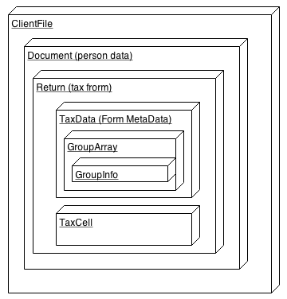

# Calc API #

## Objects diagram ##

This digram shows how the main wrappers links between each other:

## Indirect access. ##

All access to internal volatile interfaces are done, using the path or id values:
<table>
		<tr>
			<td> <strong>Internal Intreface</strong> </td>
			<td> <strong>Description</strong> </td>
			<td> <strong>Addon wrapper</strong> </td>
			<td> <strong>Linked by</strong> </td>
		</tr>
		<tr>
			<td> ICCHTaxReturn </td>
			<td> Current tax return module. </td>
			<td> IAppTaxReturn </td>
			<td> TaxApplicationService method, which get a current tax return module from ModuleManager </td>
		</tr>
		<tr>
			<td> ICCHTaxDocument </td>
			<td> Container for all returns in some client file </td>
			<td> IAppTaxDocument </td>
			<td> - GUID of the client file - Document index </td>
		</tr>
		<tr>
			<td> TCCHTaxData </td>
			<td> Container for database related information: cells, repeats, groups </td>
			<td> IAppTaxData </td>
			<td> - GUID of the client file - DocumentIndex - ReturnID </td>
		</tr>
		<tr>
			<td> TCCHTaxCell </td>
			<td> Some cell in the database </td>
			<td> IAppTaxCell </td>
			<td> - GUID of the client file - DocumentIndex - ReturnID - CellName </td>
		</tr>
		<tr>
			<td> ICCHApplication </td>
			<td> General application object singleton </td>
			<td> IAppTaxApplicationService </td>
			<td> Throw the fmAddinModule </td>
		</tr>
		<tr>
			<td> ICCHTaxApplication </td>
			<td> General tax data access singleton object </td>
			<td> IAppTaxApplicationService </td>
			<td> Throw the fmAddinModule </td>
		</tr>
		<tr>
			<td> TCCHStatusProperty </td>
			<td> List of statuses of return or document </td>
			<td> IAppStatusProperties </td>
			<td> - GUID of the client file - DocumentIndex - ReturnID  - GetReturnProperties() method of ICCHDocReturn </td>
		</tr>
		<tr>
			<td> TCCHGroupInfo </td>
			<td> General and statistical information about some repeat in the return </td>
			<td> IAppGroupInfo </td>
			<td> For now direct access - need to be fixed soon.  Should be the object of TCCHGroupArray service </td>
		</tr>
		<tr>
			<td> TCCHGroupArray </td>
			<td> The repeat representation. Accessing to the cells in the repeat. Cells enumeration. </td>
			<td> IAppGroupArray </td>
			<td> - GUID of the client file - DocumentIndex - ReturnID  - Group Name </td>
		</tr>
		<tr>
			<td> ICCHField </td>
			<td> Some field (UI object, TCCHTaxCell view) on the tax return form </td>
			<td> IAppField </td>
			<td> For now direct access - need to be fixed soon.  Should be the object of TCCHGroupArray service </td>
		</tr>
		<tr>
			<td> ICCHClientFile </td>
			<td> Client file repsentation </td>
			<td> IAPPClientFile </td>
			<td> GUID of the client file </td>
		</tr>
		<tr>
			<td> ICCHClientFileManager </td>
			<td> The container for client files </td>
			<td> IAPPClientFileManagerService </td>
			<td> Throw the fmAddinModule </td>
		</tr>
		<tr>
			<td> ICCHDocument </td>
			<td> Document (container for returns) in the client file </td>
			<td> IAppDocument </td>
			<td> - GUID of the client file - DocumentIndex </td>
		</tr>
		<tr>
			<td> ICCHDocReturn </td>
			<td> Return as a document </td>
			<td> IAppDocReturn </td>
			<td> - GUID of the client file - DocumentIndex  - ReturnID </td>
		</tr>
		<tr>
			<td> ICCHCellSelectionIter </td>
			<td> The list of cells for drag and drop </td>
			<td> IAppCellSelectionIter </td>
			<td> For now direct access - need to be fixed soon.  Should be the object of TCCHGroupArray service </td>
		</tr>
	</table>

## Interfaces ##

### IAppTaxApplicationService (global service) ###

<table>
		<tr>
			<td> <strong>Method name</strong> </td>
			<td> <strong>Description</strong> </td>
			<td> <strong>Test</strong> </td>
		</tr>
		<tr>
			<td> CanCloseClientFile(const aClientFile: IAppClientFile): WordBool; </td>
			<td> Check if the client file could be closed right now </td>
			<td> yes </td>
		</tr>
		<tr>
			<td> GetClientFileManager: IAppClientFileManagerService; </td>
			<td> Returns client file manager wrapper </td>
			<td> yes </td>
		</tr>
		<tr>
			<td> GetDefaultLanguage: AppLanguage; </td>
			<td> Returns the selected language from the application configuration </td>
			<td> yes </td>
		</tr>
		<tr>
			<td> GetProductName: WideString; </td>
			<td> Returns the product name </td>
			<td> yes </td>
		</tr>
		<tr>
			<td> GetProductSuffix: WideString; </td>
			<td> Returns the product suffix </td>
			<td> yes </td>
		</tr>
		<tr>
			<td> getIsDemo: WordBool; </td>
			<td> Returns true if the application is in the demo mode </td>
			<td> yes </td>
		</tr>
		<tr>
			<td> getIsEducative: WordBool; </td>
			<td> Returns true if the application is in for educative purpose </td>
			<td> yes </td>
		</tr>
		<tr>
			<td> getIsNetWork: WordBool; </td>
			<td> Returns true for Network version </td>
			<td> yes </td>
		</tr>
		<tr>
			<td> getIsNetworkRegular: WordBool; </td>
			<td> Returns true for regular network version </td>
			<td> yes </td>
		</tr>
		<tr>
			<td> getIsNetworkAdvanced: WordBool; </td>
			<td> Returns true for network advanced version </td>
			<td> yes </td>
		</tr>
		<tr>
			<td> getIsEFILEGovernment: WordBool; </td>
			<td> Returns true if the efile module available </td>
			<td> yes </td>
		</tr>
		<tr>
			<td> getIsCOMAvailable: WordBool; </td>
			<td> Returns true if the TaxPrep COM library available </td>
			<td> yes </td>
		</tr>
		<tr>
			<td> getProductType: Integer; </td>
			<td> integer version of product type </td>
			<td> yes </td>
		</tr>
		<tr>
			<td> GetVersionType: WideString; </td>
			<td> Version Type </td>
			<td> yes </td>
		</tr>
		<tr>
			<td> GetName: WideString; </td>
			<td> Name of the application </td>
			<td> yes </td>
		</tr>
		<tr>
			<td> GetExecutableName: WideString; </td>
			<td> TaxPrep executable file name </td>
			<td> yes </td>
		</tr>
		<tr>
			<td> GetTitleName: WideString; </td>
			<td> The tittle of the application (on task bar) </td>
			<td> yes </td>
		</tr>
		<tr>
			<td> GetSoftwareVersion: WideString; </td>
			<td> The TaxPrep version number </td>
			<td> yes </td>
		</tr>
		<tr>
			<td> GetTemplateSignaturePrefix: WideString; </td>
			<td> Template Signature Prefix </td>
			<td> yes </td>
		</tr>
		<tr>
			<td> GetIsFirstExecution: WordBool; </td>
			<td> True if the TaxPrep is run first time. </td>
			<td> yes </td>
		</tr>
		<tr>
			<td> GetConfiguration: IAppConfiguration </td>
			<td> Application configuration wrapper </td>
			<td>  yes </td>
		</tr>
		<tr>
			<td> CreateDocument: IAppDocument; </td>
			<td> Create a new document inside the current client file </td>
			<td> <strong>no</strong> </td>
		</tr>
		<tr>
			<td> GetCurrentDocument: IAppDocument; </td>
			<td> Returns the current document in the current client file </td>
			<td> yes </td>
		</tr>
		<tr>
			<td> GetString(const APath: WideString; const AID: WideString): WideString; </td>
			<td> Reads the string from resource (current language) </td>
			<td> yes </td>
		</tr>
		<tr>
			<td> GetStringWithLanguage(const APath: WideString; const AID: WideString; aLanguage: AppLanguage): WideString; </td>
			<td> Reads the string from resource </td>
			<td> yes </td>
		</tr>
		<tr>
			<td> GetMessagePath: WideString; </td>
			<td> Returns the path in the resource to the message table </td>
			<td> yes </td>
		</tr>
		<tr>
			<td> GetMessage(const AID: WideString): WideString; </td>
			<td> Returns the message text by strign indentifier </td>
			<td> yes </td>
		</tr>
		<tr>
			<td> <em>GetVersionInfo: IUnknown;</em> </td>
			<td> Returns the version info intreface wrapper (not implemented yet) </td>
			<td> no </td>
		</tr>
		<tr>
			<td> ShowMessageString(const Title: WideString; const aMessage: WideString): Integer; </td>
			<td> Show the message dialog in the same way as it does by TaxPrep </td>
			<td> no </td>
		</tr>
		<tr>
			<td> procedure SetAppStatusBar(const aValue: WideString); </td>
			<td> Set the status bar text in the TaxPrep main form </td>
			<td> no </td>
		</tr>
		<tr>
			<td> GetStatusBarText: WideString; </td>
			<td> Return the current status bar taxt i nthe TaxPrep main form </td>
			<td> yes </td>
		</tr>
		<tr>
			<td> <em>GetDBEnv: IUnknown;</em> </td>
			<td> Shuld return the database manager object (not implemented yet) </td>
			<td> no </td>
		</tr>
		<tr>
			<td> GetYear: Integer; </td>
			<td> Return the current year </td>
			<td> yes </td>
		</tr>
		<tr>
			<td> GetCurrentField: IAppFIeld; </td>
			<td> Return the select field (on UI) </td>
			<td> yes </td>
		</tr>
		<tr>
			<td> GetCurrentTaxData: IAppTaxData; </td>
			<td> Return the current tax data of tax return </td>
			<td> yes </td>
		</tr>
		<tr>
			<td> GetCurrentTaxReturn: IAppTaxReturn; </td>
			<td> Return the current tax return </td>
			<td> yes </td>
		</tr>
		<tr>
			<td> GetCurrentTaxCell: IAppTaxCell; </td>
			<td> Return the current tax cell </td>
			<td> yes </td>
		</tr>
		<tr>
			<td> GetCurrentDocReturn: IAppDocReturn; </td>
			<td> Return the current doc return object </td>
			<td> yes </td>
		</tr>
	</table>

### IAppClientFileEventsService (global service) ###

<table>
		<tr>
			<td> <strong>Event name</strong> </td>
			<td> <strong>Description</strong> </td>
			<td> <strong>Test</strong> </td>
		</tr>
		<tr>
			<td> BeforeClientFileNameChange </td>
			<td> Handled when the before the client file name to be changed </td>
			<td> yes </td>
		</tr>
		<tr>
			<td> AfterClientFileNameChange </td>
			<td> Handled when the after the client file name has been changed </td>
			<td> yes </td>
		</tr>
		<tr>
			<td> BeforeClientFileSave </td>
			<td> Handled before the current client file to be saved </td>
			<td> yes </td>
		</tr>
		<tr>
			<td> AfterClientFileSave </td>
			<td> Handled after the client file has been saved </td>
			<td> yes </td>
		</tr>
		<tr>
			<td> AfterChangeClientFileHeaderProperty </td>
			<td> Handled after the some header property was changed in the client file </td>
			<td> yes </td>
		</tr>
		<tr>
			<td> BeforeDocumentAdd </td>
			<td> Handled before some document to be added in the client file </td>
			<td> yes </td>
		</tr>
		<tr>
			<td> AfterDocumentAdd </td>
			<td> Handled after the document has been added to the client file </td>
			<td> yes </td>
		</tr>
		<tr>
			<td> BeforeDocumentRemove </td>
			<td> Handled before the document to be removed from the client file </td>
			<td> yes </td>
		</tr>
		<tr>
			<td> AfterDocumentRemove </td>
			<td> Handled before the document has been removed from the client file </td>
			<td> yes </td>
		</tr>
		<tr>
			<td> BeforeCurrentDocumentChange </td>
			<td> Handled before the current document to be changed </td>
			<td> yes </td>
		</tr>
		<tr>
			<td> AfterCurrentDocumentChange </td>
			<td> Handled after the current document has been changed </td>
			<td> yes </td>
		</tr>
		<tr>
			<td> BeforeReturnStatusChange </td>
			<td> Handled before the property will be changed in the return or document </td>
			<td> yes </td>
		</tr>
	</table>

### IAppClientFileManagerService (global service) ###

<table>
		<tr>
			<td> <strong>Method name</strong> </td>
			<td> <strong>Description</strong> </td>
			<td> <strong>Test</strong> </td>
		</tr>
		<tr>
			<td> NewClientFile(const AFilePath: WideString; out aClientFile: IAppClientFile): WordBool; </td>
			<td> Creates a new client file with given properties </td>
			<td> no </td>
		</tr>
		<tr>
			<td> OpenClientFile(const AFilePath: WideString; out aClientFile: IAppClientFile): WordBool; </td>
			<td> Open an existed client file. </td>
			<td> no </td>
		</tr>
		<tr>
			<td> CloseCurrentClientFile(AWithManager: WordBool): WordBool; </td>
			<td> Use it to close the current client file. </td>
			<td> no </td>
		</tr>
		<tr>
			<td> AddClientFile(const aClientFile: IAppClientFile): Integer; </td>
			<td> Adds the client file to client file manager. </td>
			<td> no </td>
		</tr>
		<tr>
			<td> procedure InsertClientFile(AIndex: Integer; const aClientFile: IAppClientFile); </td>
			<td> Insert the client file to manager with apropriate index. </td>
			<td> no </td>
		</tr>
		<tr>
			<td> procedure DeleteClientFile(AIndex: Integer); </td>
			<td> Removes the client file from manager by index. </td>
			<td> no </td>
		</tr>
		<tr>
			<td> RemoveClientFile(const aClientFile: IAppClientFile): Integer; </td>
			<td> Removes the client file from manager by interface. </td>
			<td> no </td>
		</tr>
		<tr>
			<td> procedure ClearClientFiles; </td>
			<td> Clear the client file manager's list </td>
			<td> no </td>
		</tr>
		<tr>
			<td> GetClientFileByFilePath(const AFilePath: WideString): IAppClientFile; </td>
			<td> Search for client file by it's file path </td>
			<td> no </td>
		</tr>
		<tr>
			<td> GetClientFile(AIndex: Integer): IAppClientFile; </td>
			<td> Gets the client file by index from the list. </td>
			<td> yes </td>
		</tr>
		<tr>
			<td> GetCurrentClientFile: IAppClientFile; </td>
			<td> Returns the current client file. </td>
			<td> yes </td>
		</tr>
		<tr>
			<td> procedure SetCurrentClientFile(const aClientFile: IAppClientFile); </td>
			<td> Sets the current client file. </td>
			<td> yes </td>
		</tr>
		<tr>
			<td> GetCurrentClientFileIndex: Integer; </td>
			<td> Retuns the current client file index. </td>
			<td> no </td>
		</tr>
		<tr>
			<td> procedure SetCurrentClientFileIndex(AClientFileIndex: Integer); </td>
			<td> Sets the current client file by it's index. </td>
			<td> no </td>
		</tr>
		<tr>
			<td> procedure GetCurrentDocument(var AResult: IAppDocument); </td>
			<td> Returns the current IAppDocument </td>
			<td> yes </td>
		</tr>
		<tr>
			<td> GetCurrentDocIndex: LongWord; </td>
			<td> Returns the current document index. </td>
			<td> yes </td>
		</tr>
		<tr>
			<td> GetCurrentTaxDocument: IAppTaxDocument; </td>
			<td> Returns the current TaxDocument </td>
			<td> yes </td>
		</tr>
		<tr>
			<td> GetCurrentReturn: IAppDocReturn; </td>
			<td> Returns the current IAppDocReturn </td>
			<td> yes </td>
		</tr>
		<tr>
			<td> GetCurrentReturnId: LongWord; </td>
			<td> Returns the current return's unique ID. </td>
			<td> yes </td>
		</tr>
		<tr>
			<td> SetCurrentDocument(AClientFileIndex: Integer; ADocIndex: LongWord): WordBool; </td>
			<td> Set current client file and document. </td>
			<td> no </td>
		</tr>
		<tr>
			<td> SetCurrentReturn(AClientFileIndex: Integer; ADocIndex: LongWord; aReturnId: LongWord): WordBool; </td>
			<td> Set current client file, document and return. </td>
			<td> no </td>
		</tr>
		<tr>
			<td> GetCount: Integer; </td>
			<td> Returns the clien files count </td>
			<td> yes </td>
		</tr>
		<tr>
			<td> procedure SilentOpenMode; </td>
			<td> Set the silent open mode (no UI). </td>
			<td> yes </td>
		</tr>
		<tr>
			<td> procedure BackupFiles; </td>
			<td> Create the backups for all client files. </td>
			<td> yes </td>
		</tr>
		<tr>
			<td> procedure SetBackupEnabled(Value: WordBool); </td>
			<td> Enable or disable backups </td>
			<td> yes </td>
		</tr>
		<tr>
			<td> IsBackupEnabled: WordBool; </td>
			<td> Return true if the backup is enabled. </td>
			<td> yes </td>
		</tr>
		<tr>
			<td> GetVersionInfo: WideString; </td>
			<td> Returns the version information as a string. </td>
			<td> yes </td>
		</tr>
	</table>

### IAPPClientFile (local service) ###

Addon should react on some ClienFileManager event or run the method of client file manager to access this class.

<table>
		<tr>
			<td> <strong>Method name</strong> </td>
			<td> <strong>Description</strong> </td>
			<td> <strong>Test</strong> </td>
		</tr>
		<tr>
			<td> CreateNew(const AFilePath: WideString): WordBool; </td>
			<td> Create a new file on a given location. </td>
			<td> no </td>
		</tr>
		<tr>
			<td> Open(const AFilePath: WideString): WordBool; </td>
			<td> Opens an existed client file. </td>
			<td> no </td>
		</tr>
		<tr>
			<td> Save(const AFilePath: WideString): WordBool; </td>
			<td> Save the client file to disk. </td>
			<td> yes </td>
		</tr>
		<tr>
			<td> SaveQuietly(const AFilePath: WideString): WordBool; </td>
			<td> Save the client file without any request to user. </td>
			<td> yes </td>
		</tr>
		<tr>
			<td> Backup(const Path: WideString; const Ext: WideString): WordBool; </td>
			<td> Creates a backup for the client file. </td>
			<td> yes </td>
		</tr>
		<tr>
			<td> LoadHeader(const AFilePath: WideString): WordBool; </td>
			<td> Loads only the client file headers. </td>
			<td> no </td>
		</tr>
		<tr>
			<td> SaveHeader(const AFilePath: WideString): WordBool; </td>
			<td> Saves only the client file headers. </td>
			<td> no </td>
		</tr>
		<tr>
			<td> procedure RestorePathName; </td>
			<td> Restore the the original path. </td>
			<td> yes </td>
		</tr>
		<tr>
			<td> procedure CommitPathName; </td>
			<td> Apply the file path. </td>
			<td> yes </td>
		</tr>
		<tr>
			<td> procedure SetPathFileName(const AFilePath: WideString); </td>
			<td> Changes the file path. </td>
			<td> no </td>
		</tr>
		<tr>
			<td> GetDisplayPathFileName: WideString; </td>
			<td> Returns the file name. </td>
			<td> yes </td>
		</tr>
		<tr>
			<td> GetTryingSavePathName: WideString; </td>
			<td> ??? </td>
			<td> yes </td>
		</tr>
		<tr>
			<td> IsOpen: WordBool; </td>
			<td> Returns true if file is opened. </td>
			<td> yes </td>
		</tr>
		<tr>
			<td> IsNew: WordBool; </td>
			<td> Returns true is the file is new (did not saved any time) </td>
			<td> yes </td>
		</tr>
		<tr>
			<td> NewForRoll: WordBool; </td>
			<td> True if the file is applicable for roll forward. </td>
			<td> yes </td>
		</tr>
		<tr>
			<td> procedure SetIsNew; </td>
			<td> Sets IsNew flag to true. </td>
			<td> no </td>
		</tr>
		<tr>
			<td> IsDirty: WordBool; </td>
			<td> Set the Dirty flag to true. </td>
			<td> yes </td>
		</tr>
		<tr>
			<td> procedure resetDirty; </td>
			<td> Set the Dirty flag to false. </td>
			<td> yes </td>
		</tr>
		<tr>
			<td> procedure SetDirty(AValue: WordBool); </td>
			<td> Set the dirrty flag value. </td>
			<td> yes </td>
		</tr>
		<tr>
			<td> procedure CreateTimeStamp; </td>
			<td> Creates a new TiemStamp </td>
			<td> yes </td>
		</tr>
		<tr>
			<td> procedure CreateGUID; </td>
			<td> Create a new file GUID </td>
			<td> yes </td>
		</tr>
		<tr>
			<td> GetGUID: WideString; </td>
			<td> Returns the file GUID. </td>
			<td> yes </td>
		</tr>
		<tr>
			<td> AddDocument(ADocIndex: LongWord; const ADocName: WideString; const ATaxClient: IUnknown): Integer; </td>
			<td> Adds a new Document to client file (not yet fully implemented) </td>
			<td> no </td>
		</tr>
		<tr>
			<td> AddScenario(const ADocName: WideString): Integer; </td>
			<td> Adds a new scenario </td>
			<td> yes </td>
		</tr>
		<tr>
			<td> RemoveDocument(ADocIndex: LongWord): WordBool; </td>
			<td> Removes the document by index. </td>
			<td> no </td>
		</tr>
		<tr>
			<td> procedure Clear; </td>
			<td> Clears the documents. </td>
			<td> no </td>
		</tr>
		<tr>
			<td> LoadDocuments: WordBool; </td>
			<td> Loads the documents and returns the status of action. </td>
			<td> no </td>
		</tr>
		<tr>
			<td> LoadDocumentByIndex(ADocIndex: LongWord): WordBool; </td>
			<td> Loads the document by it's index. </td>
			<td> no </td>
		</tr>
		<tr>
			<td> LoadDocumentByInterface(const ADocument: IAppDocument): WordBool; </td>
			<td> Loads the document by it's IAppDocument wrapper. </td>
			<td> no </td>
		</tr>
		<tr>
			<td> LoadDocumentHeaderByIndex(ADocIndex: LongWord): WordBool; </td>
			<td> Loads the document's header by document index. </td>
			<td> no </td>
		</tr>
		<tr>
			<td> LoadDocumentHeaderByInterface(const ADocument: IAppDocument): WordBool; </td>
			<td> Loads the document's header by IAppDocument wrapper. </td>
			<td> no </td>
		</tr>
		<tr>
			<td> SaveDocumentByIndex(ADocIndex: LongWord): WordBool; </td>
			<td> Saves the document by it's index </td>
			<td> yes </td>
		</tr>
		<tr>
			<td> SaveDocumentByInterface(const ADocument: IAppDocument): WordBool; </td>
			<td> Saves the document by it's wrapper </td>
			<td> yes </td>
		</tr>
		<tr>
			<td> SaveSystemHeadersNoUserDirty: WordBool; </td>
			<td> Saves the system headers, but not change the UserDirty flag. </td>
			<td> yes </td>
		</tr>
		<tr>
			<td> IsDocumentLoaded(ADocIndex: LongWord): WordBool; </td>
			<td> Returns true if the document with document index is loaded. </td>
			<td> yes </td>
		</tr>
		<tr>
			<td> EraseDocument(ADocIndex: LongWord): WordBool; </td>
			<td> Removes the document from client file by it's index. </td>
			<td> no </td>
		</tr>
		<tr>
			<td> GetDocument(ADocIndex: LongWord): IAppDocument; </td>
			<td> Returns the document's wrapper by document's index. </td>
			<td> yes </td>
		</tr>
		<tr>
			<td> GetDocInfo(ADocIndex: LongWord): IUnknown; </td>
			<td> Returns the statistical information about document (Not yet implmented) </td>
			<td> no </td>
		</tr>
		<tr>
			<td> GetDocIndexByListIndex(AListIndex: Integer): LongWord; </td>
			<td> Returns the document index by index in the document's list. </td>
			<td> yes </td>
		</tr>
		<tr>
			<td> GetDocumentFromList(Ndx: Integer; loadDocIfNotExists: WordBool): IAppDocument; </td>
			<td> Enumerates documents. </td>
			<td> yes </td>
		</tr>
		<tr>
			<td> GetCurrentDocIndex: LongWord; </td>
			<td> Returns the index of current document. </td>
			<td> yes </td>
		</tr>
		<tr>
			<td> GetCurrentDocListIndex: Integer; </td>
			<td> Returns the index in the list of current document. </td>
			<td> yes </td>
		</tr>
		<tr>
			<td> GetCurrentYearDocument: IAppDocument; </td>
			<td> Returns the current year document. </td>
			<td> yes </td>
		</tr>
		<tr>
			<td> GetTaxDocument(ADocIndex: LongWord; out ATaxDocument: IAppTaxDocument): WordBool; </td>
			<td> Returns IAppTaxDocument by document index. </td>
			<td> yes </td>
		</tr>
		<tr>
			<td> GetCurrentTaxDocument(out ATaxDocument: IAppTaxDocument): WordBool; </td>
			<td> Returns the current IAppTaxDocument. </td>
			<td> yes </td>
		</tr>
		<tr>
			<td> SetDefaultCurrentDocument: WordBool; </td>
			<td> Set the current document as default. </td>
			<td> yes </td>
		</tr>
		<tr>
			<td> SetCurrentDocument(ADocIndex: LongWord; ForceEvents: WordBool): WordBool; </td>
			<td> Sets the current document by index. </td>
			<td> no </td>
		</tr>
		<tr>
			<td> SetCurrentDocumentFromList(Ndx: Integer; UnSelectReturn: WordBool; ForceEvents: WordBool): WordBool; </td>
			<td> Sets the current document by list index. </td>
			<td> no </td>
		</tr>
		<tr>
			<td> SetScenarioAsCurrentYear: WordBool; </td>
			<td> Set the scenarion as a current year. </td>
			<td> yes </td>
		</tr>
		<tr>
			<td> GetScenarioCount: Integer; </td>
			<td> Returns the count of scenarion. </td>
			<td> yes </td>
		</tr>
		<tr>
			<td> GetLastScenarioIndex: LongWord; </td>
			<td> Returns the last scenarion index. </td>
			<td> yes </td>
		</tr>
		<tr>
			<td> GetLastScenarioDocIndex: LongWord; </td>
			<td> Returns the doc index of last scenarion. </td>
			<td> yes </td>
		</tr>
		<tr>
			<td> CurrentYearExists: WordBool; </td>
			<td> Returns true is the current year information exists in the client file. </td>
			<td> yes </td>
		</tr>
		<tr>
			<td> LastYearExists: WordBool; </td>
			<td> Returns true is the last year information exist in the client file. </td>
			<td> yes </td>
		</tr>
		<tr>
			<td> PlanningExists: WordBool; </td>
			<td> Returns true if the planning exists in the client file. </td>
			<td> yes </td>
		</tr>
		<tr>
			<td> GetCount: Integer; </td>
			<td> Returns count of documents inside the client file. </td>
			<td> yes </td>
		</tr>
		<tr>
			<td> GetDocumentByIndex(AIndex: Integer): IAppDocument; </td>
			<td> Returns document by Document index. </td>
			<td> yes </td>
		</tr>
		<tr>
			<td> ListIndexOfInterface(const ADocument: IAppDocument): Integer; </td>
			<td> Returns ListIndex of document. </td>
			<td> yes </td>
		</tr>
		<tr>
			<td> ListIndexOfDocIndex(ADocIndex: LongWord): Integer; </td>
			<td> Returns List index by document's index. </td>
			<td> yes </td>
		</tr>
		<tr>
			<td> IsValidListIndex(AIndex: Integer): WordBool; </td>
			<td> Returns true if the given list index is valid. </td>
			<td> yes </td>
		</tr>
		<tr>
			<td> IsValidCurrentListIndex: WordBool; </td>
			<td> Return true the current list index is valid. </td>
			<td> yes </td>
		</tr>
		<tr>
			<td> GetDocumentName(ADocIndex: LongWord): WideString; </td>
			<td> Returns document name by document index. </td>
			<td> yes </td>
		</tr>
		<tr>
			<td> IsUniqueDocumentName(const AName: WideString): WordBool; </td>
			<td> Returns false if the document with the same name is existed in the client file. </td>
			<td> yes </td>
		</tr>
		<tr>
			<td> GetCurrentReturn: IAppDocReturn; </td>
			<td> Returns the current IAppDocReturn. </td>
			<td> yes </td>
		</tr>
		<tr>
			<td> GetCurrentReturnId: LongWord; </td>
			<td> Retuns the current return ID. </td>
			<td> yes </td>
		</tr>
		<tr>
			<td> GetDatabaseEnv: IUnknown; </td>
			<td> Returns the database env wrapper (not yet implemented) </td>
			<td> no </td>
		</tr>
		<tr>
			<td> LoadLastYearDocument(const AFilePath: WideString): WordBool; </td>
			<td> Loads the last year document from the provided file path. </td>
			<td> no </td>
		</tr>
		<tr>
			<td> LoadLastYearPlanner(const AFilePath: WideString): WordBool; </td>
			<td> Loads the last year planner from the provided file path. </td>
			<td> no </td>
		</tr>
		<tr>
			<td> GetTaxPayer(aReturnId: LongWord): WideString; </td>
			<td> Return TaxPayer name by return id. </td>
			<td> yes </td>
		</tr>
		<tr>
			<td> procedure RunCalcForAllReturns; </td>
			<td> Runs the calc cycle for all returns in the client file. </td>
			<td> yes </td>
		</tr>
		<tr>
			<td> GetDocInfoByDocType(aDocType: AppDocType): IUnknown; </td>
			<td> Returns the document statistical information (not yet implemented.) </td>
			<td> no </td>
		</tr>
		<tr>
			<td> getAskedOptions(Value: AppAskOption): WordBool; </td>
			<td> Return the asked option value. </td>
			<td> yes </td>
		</tr>
		<tr>
			<td> procedure setAskedOptions(Value: AppAskOption; add: WordBool); </td>
			<td> Sets the asked option value. </td>
			<td> yes </td>
		</tr>
		<tr>
			<td> procedure SetReadOnlyFileAttr(Value: WordBool); </td>
			<td> Set the file as readonly. </td>
			<td> yes </td>
		</tr>
		<tr>
			<td> HasPassword: WordBool; </td>
			<td> Returns true if the document has password. </td>
			<td> yes </td>
		</tr>
		<tr>
			<td> CreateAttachmentManager: IUnknown; </td>
			<td> Returns the attachment manager. (not yet implemented) </td>
			<td> no </td>
		</tr>
		<tr>
			<td> GetClientFileLinksMgr: IUnknown; </td>
			<td> Returns links manager (not yet implemented) </td>
			<td> no </td>
		</tr>
		<tr>
			<td> GetFileOpenMode: LongWord; </td>
			<td> Returns the file open mode (the same as in WinAPI). </td>
			<td> yes </td>
		</tr>
		<tr>
			<td> GetFileOpenReadOnly: WordBool; </td>
			<td> Returns true if the client file is read only. </td>
			<td> yes </td>
		</tr>
		<tr>
			<td> GetDataTracking: WordBool; </td>
			<td> Returns true if the data is tracked. </td>
			<td> yes </td>
		</tr>
		<tr>
			<td> GetDataLocked: WordBool; </td>
			<td> Return true if the data is locked. </td>
			<td> yes </td>
		</tr>
		<tr>
			<td> procedure SetDataLocked(ADataLocked: WordBool); </td>
			<td> Set DataLocked flag. </td>
			<td> yes </td>
		</tr>
		<tr>
			<td> procedure SetSystemDataLocked(ADataLocked: WordBool); </td>
			<td> Set the systen data as locked. </td>
			<td> yes </td>
		</tr>
		<tr>
			<td> GetSystemLocked: WordBool; </td>
			<td> Returns true if the system data is locked. </td>
			<td> yes </td>
		</tr>
		<tr>
			<td> procedure SetSystemLocked(Lock: WordBool); </td>
			<td> Set the system locked. </td>
			<td> yes </td>
		</tr>
		<tr>
			<td> GetSystemLockedBy(out AName: WideString): WordBool; </td>
			<td> Returns the name of user who locked the system. </td>
			<td> yes </td>
		</tr>
		<tr>
			<td> IsSystemLockedByCurrentUser: WordBool; </td>
			<td> Returns true if the system is locked by current user. </td>
			<td> yes </td>
		</tr>
		<tr>
			<td> procedure SetLanguage(ALanguage: AppLanguage); </td>
			<td> Sets the lanaguage. </td>
			<td> yes </td>
		</tr>
		<tr>
			<td> GetLanguage: AppLanguage; </td>
			<td> Returns the selected language. </td>
			<td> yes </td>
		</tr>
		<tr>
			<td> GetCanSaveFile: WordBool; </td>
			<td> Returns true if the file could be saved. </td>
			<td> yes </td>
		</tr>
		<tr>
			<td> GetCanModifyData: WordBool; </td>
			<td> Retrusn true if the file could be modified. </td>
			<td> yes </td>
		</tr>
		<tr>
			<td> GetOpenResult: AppOpenResult; </td>
			<td> Returns the result of open file action. </td>
			<td> yes </td>
		</tr>
		<tr>
			<td> procedure SetOpenResult(AResult: AppOpenResult); </td>
			<td> Sets the open file result. </td>
			<td> no </td>
		</tr>
		<tr>
			<td> GetSaveResult: AppSaveResult; </td>
			<td> Returns the result of save action. </td>
			<td> yes </td>
		</tr>
		<tr>
			<td> GetDateTime: WideString; </td>
			<td> Returns the current date time as a string. </td>
			<td> yes </td>
		</tr>
		<tr>
			<td> IsPlanner: WordBool; </td>
			<td> Returns true if the file is planner. </td>
			<td> yes </td>
		</tr>
		<tr>
			<td> procedure SetPlanner; </td>
			<td> Set the file as planner. </td>
			<td> yes </td>
		</tr>
		<tr>
			<td> GetOldFileName: WideString; </td>
			<td> Returns the previous file name. </td>
			<td> yes </td>
		</tr>
		<tr>
			<td> procedure SetOldFileName(const Value: WideString); </td>
			<td> Sets the previous file name. </td>
			<td> no </td>
		</tr>
		<tr>
			<td> IsCouplingUpdated: WordBool; </td>
			<td> Returns true if the coupling is updated. </td>
			<td> yes </td>
		</tr>
		<tr>
			<td> procedure SetCouplingUpdated; </td>
			<td> Set the CouplingUpdated flag as true. </td>
			<td> no </td>
		</tr>
		<tr>
			<td> GetReadOnlyFileAttr: WordBool; </td>
			<td> Returns the read only file attr. </td>
			<td> yes </td>
		</tr>
		<tr>
			<td> GetCalcPersonalDiags: WordBool; </td>
			<td> Calculate the personal diagnostics. </td>
			<td> yes </td>
		</tr>
		<tr>
			<td> GetIsNewerDataBaseTemplate: WordBool; </td>
			<td> Returns true if the file is built with the newer database template. </td>
			<td> yes </td>
		</tr>
		<tr>
			<td> procedure SetIsNewerDataBaseTemplate(aNewerDataBaseTemplate: WordBool); </td>
			<td> Set the IsNewerDatabaseTemplate flag's value. </td>
			<td> yes </td>
		</tr>
		<tr>
			<td> GetListOfReturnIDCount: Integer; </td>
			<td> Returns the count of list of return id. </td>
			<td> yes </td>
		</tr>
		<tr>
			<td> GetListOfReturnIDItem(AIndex: Integer): WideString; </td>
			<td> Return the return id by index. </td>
			<td> yes </td>
		</tr>
		<tr>
			<td> procedure SetRecalcAlways; </td>
			<td> Set the RecalAlways flag value. </td>
			<td> yes </td>
		</tr>
		<tr>
			<td> CanRecalcAlways: WordBool; </td>
			<td> Returns true if the client file could be always recalculated. </td>
			<td> yes </td>
		</tr>
	</table>

### IAppTaxDocument (local service) ###

<table>
		<tr>
			<td> <strong>Method name</strong> </td>
			<td> <strong>Description</strong> </td>
			<td> <strong>Test</strong> </td>
		</tr>
		<tr>
			<td> GetTaxpayerIdInReturn(aReturn: LongWord): WideString; </td>
			<td> Returns the taxpayer's ID in the given return. </td>
			<td> no </td>
		</tr>
		<tr>
			<td> GetFileTimeStamp: WideString; </td>
			<td> Returns the time stamp of the client file. </td>
			<td> no </td>
		</tr>
		<tr>
			<td> GetTaxationYearEnd(const aReturn: IAppDocReturn): WideString; </td>
			<td> retirns the end date of taxation year. </td>
			<td> no </td>
		</tr>
		<tr>
			<td> ResetDirty; </td>
			<td> Sets the Dirty flag to false. </td>
			<td> no </td>
		</tr>
		<tr>
			<td> IsDirty: WordBool; </td>
			<td> Returns the dirty flag. </td>
			<td> yes </td>
		</tr>
		<tr>
			<td> GetDbEnv: IUnknown; </td>
			<td> Returns the DdEnv wrapper (not yet implemented) </td>
			<td> no </td>
		</tr>
		<tr>
			<td> GetDatabase: IUnknown; </td>
			<td> Return the Database wrapper (not yet implemented) </td>
			<td> no </td>
		</tr>
		<tr>
			<td> GetCurrentTaxData: IAppTaxData; </td>
			<td> Return's the current tax data. </td>
			<td> yes </td>
		</tr>
		<tr>
			<td> NewDocument(const aName: WideString); </td>
			<td> Creates a new document with a given name. </td>
			<td> no </td>
		</tr>
		<tr>
			<td> FindDocReturn(aReturnId: LongWord): IAppDocReturn; </td>
			<td> Find the DocReturn by ReturnID. </td>
			<td> yes </td>
		</tr>
		<tr>
			<td> GetCurrentReturnId: LongWord; </td>
			<td> Returns the current return ID. </td>
			<td> yes </td>
		</tr>
		<tr>
			<td> CurrentReturn: IAppDocReturn; </td>
			<td> Returns the current return wrapper. </td>
			<td> yes </td>
		</tr>
		<tr>
			<td> GetReturnAt(anIndex: Integer): IAppDocReturn; </td>
			<td> Enumerates the returns. </td>
			<td> yes </td>
		</tr>
		<tr>
			<td> GetReturnCount: Integer; </td>
			<td> Returns the return count. </td>
			<td> yes </td>
		</tr>
		<tr>
			<td> IndexOf(const aDocReturn: IAppDocReturn): Integer; </td>
			<td> Returns the index of return wrapper. </td>
			<td> yes </td>
		</tr>
		<tr>
			<td> UpdateAllHeaders; </td>
			<td> Update the values of all headers. </td>
			<td> no </td>
		</tr>
		<tr>
			<td> AddDocReturnForExistingTaxData(AReturnId: LongWord); </td>
			<td> creates the document for existing tax data. </td>
			<td> no </td>
		</tr>
		<tr>
			<td> GetStatus: IUnknown; </td>
			<td> Returns the status wrapper (not yet implemented) </td>
			<td> no </td>
		</tr>
		<tr>
			<td> SelectReturn(aReturnId: LongWord; ForceEvents: WordBool): WordBool; </td>
			<td> Selects the return by return id. </td>
			<td> no </td>
		</tr>
		<tr>
			<td> RemoveReturn(returnId: LongWord); </td>
			<td> Removes the return from the document by return id. </td>
			<td> no </td>
		</tr>
		<tr>
			<td> getDocumentProperties: IAppProperties; </td>
			<td> Returns the document properties wrapper </td>
			<td> yes </td>
		</tr>
		<tr>
			<td> getReturnProperties(aReturnId: LongWord): IAppStatusProperties; </td>
			<td> Returns the return proeprties wrapper. </td>
			<td> yes </td>
		</tr>
		<tr>
			<td> GetCalcVersionFromHeader: WideString; </td>
			<td> Returns the calc engine version from document header. </td>
			<td> no </td>
		</tr>
		<tr>
			<td> GetDocIndexStr: WideString; </td>
			<td> Returns document index as string. </td>
			<td> no </td>
		</tr>
		<tr>
			<td> SetDocIndexStr(const AName: WideString); </td>
			<td> Sets the document index as string.  </td>
			<td> no </td>
		</tr>
		<tr>
			<td> IsReturnRegistered(AReturnId: LongWord): WordBool; </td>
			<td> Returns true if the return with given ID is registered in the document. </td>
			<td> no </td>
		</tr>
		<tr>
			<td> IsReturnRegisteredWithBankId(AReturnId: LongWord; out aWithBlankID: WordBool): WordBool; </td>
			<td> the same + bank id </td>
			<td> no </td>
		</tr>
		<tr>
			<td> IsRolled: WordBool; </td>
			<td> Return true if the document is rolled. </td>
			<td> yes </td>
		</tr>
		<tr>
			<td> SystemDirty: WordBool; </td>
			<td> sets the system dirty flag as true. </td>
			<td> yes </td>
		</tr>
		<tr>
			<td> SetCalcDirty(aDirty_: WordBool); </td>
			<td> set the calc dirty flag value. </td>
			<td> no </td>
		</tr>
		<tr>
			<td> IsCalcDirty: WordBool; </td>
			<td> returns calc dirty flag. </td>
			<td> yes </td>
		</tr>
		<tr>
			<td> SetCalcPersonalDiagInterrupted(AValue: WordBool); </td>
			<td> sets CalcPersonalDiagInterrupted flag value. </td>
			<td> no </td>
		</tr>
		<tr>
			<td> GetCalcPersonalDiagInterrupted: WordBool; </td>
			<td> returns CalcPersonalDiagInterrupted value. </td>
			<td> yes </td>
		</tr>
		<tr>
			<td> UpdateDatabaseFromAllHeaders; </td>
			<td> updates the database values from header's values. </td>
			<td> no </td>
		</tr>
		<tr>
			<td> getDocIndex: Integer; </td>
			<td> Returns the doc index. </td>
			<td> yes </td>
		</tr>
	</table>

### IAppDocReturn (local service) ###

<table>
		<tr>
			<td> <strong>Method name</strong> </td>
			<td> <strong>Description</strong> </td>
			<td> <strong>Test</strong> </td>
		</tr>
		<tr>
			<td> GetProperties: IAppStatusProperties; </td>
			<td> Returns the return statuses objects. </td>
			<td> yes </td>
		</tr>
		<tr>
			<td> GetReturnPath: WideString; </td>
			<td> Returns the string representation of return path </td>
			<td> yes </td>
		</tr>
		<tr>
			<td> GetReturnId: LongWord; </td>
			<td> Use to get the return unique ID. </td>
			<td> yes </td>
		</tr>
		<tr>
			<td> GetDocument: IAppDocument; </td>
			<td> Returns the owner document interface. </td>
			<td> yes </td>
		</tr>
		<tr>
			<td> IsNameAssigned: WordBool; </td>
			<td> Returns true if the name is assigned. </td>
			<td> no </td>
		</tr>
		<tr>
			<td> GetTaxData: IAppTaxData; </td>
			<td> Returns the TaxData interface. </td>
			<td> yes </td>
		</tr>
		<tr>
			<td> SetDirty; </td>
			<td> Mark the return as dirty (not saved) </td>
			<td> no </td>
		</tr>
		<tr>
			<td> GetIsSystemDirty: WordBool; </td>
			<td> Returns true if the tax system is dirty (not stored) </td>
			<td> yes </td>
		</tr>
		<tr>
			<td> SetIsSystemDirty(AValue: WordBool); </td>
			<td> Mark the tax system as non-stored </td>
			<td> no </td>
		</tr>
		<tr>
			<td> IsApplicable(aFormIndex: LongWord): WordBool; </td>
			<td> Returns true if the form with aFormIndex is applicable for this return. </td>
			<td> no </td>
		</tr>
		<tr>
			<td> IsApplicableForRepeat(aFormIndex: LongWord; aRepeatNum: LongWord): WordBool; </td>
			<td> Returns true if the return is applicable for form and repeat number </td>
			<td> no </td>
		</tr>
		<tr>
			<td> IsApplicableForRepeatPath(aFormIndex: LongWord; const aRepeatPath: WideString; aRepeat: LongWord): WordBool; </td>
			<td> Returns true if it is applicable for some form and the repeat specified by its repeat path. </td>
			<td> no </td>
		</tr>
		<tr>
			<td> GetPropertyNameByCellName(const CellName: WideString; out PropertyName: WideString): WordBool; </td>
			<td> Returns status property name by some cell, if it is assignedd to some property. </td>
			<td> no </td>
		</tr>
		<tr>
			<td> resetDirty: WordBool; </td>
			<td> resets the dirty flag </td>
			<td> no </td>
		</tr>
		<tr>
			<td> <em>GetInputList: IUnknown;</em> </td>
			<td> Returns the list of possible inputs (not implemented yet) </td>
			<td> no </td>
		</tr>
		<tr>
			<td> getAttachmentPath: WideString; </td>
			<td> Returns the path to the attachmenets </td>
			<td> no </td>
		</tr>
		<tr>
			<td> GetDiagnostic: IAppDiagnostic; </td>
			<td> Returns the dignostic object. </td>
			<td> yes </td>
		</tr>
	</table>

### IAppStatusProperties (local service) ###

<table>
		<tr>
			<td> <strong>Method name</strong> </td>
			<td> <strong>Description</strong> </td>
			<td> <strong>Test</strong> </td>
		</tr>
		<tr>
			<td> SetStringNoUserDirty(const aKey: WideString; const aValue: WideString): WordBool; </td>
			<td> Set string value and do not set change the UserDirty flag </td>
			<td> no </td>
		</tr>
		<tr>
			<td> SetIntegerNoUserDirty(const aKey: WideString; aValue: Integer): WordBool; </td>
			<td> Set integer value and do not set change the UserDirty flag </td>
			<td> no </td>
		</tr>
		<tr>
			<td> SetBooleanNoUserDirty(const aKey: WideString; aValue: WordBool): WordBool; </td>
			<td> Set boolean value and do not set change the UserDirty flag </td>
			<td> no </td>
		</tr>
		<tr>
			<td> SetCurrencyNoUserDirty(const aKey: WideString; aValue: Currency): WordBool; </td>
			<td> Set currency value and do not set change the UserDirty flag </td>
			<td> no </td>
		</tr>
		<tr>
			<td> SetDateTimeNoUserDirty(const aKey: WideString; aValue: TDateTime): WordBool; </td>
			<td> Set datetime value and do not set change the UserDirty flag </td>
			<td> no </td>
		</tr>
		<tr>
			<td> SetString(const aKey: WideString; const aValue: WideString): WordBool; </td>
			<td> Sets the string value. </td>
			<td> yes </td>
		</tr>
		<tr>
			<td> SetInteger(const aKey: WideString; aValue: Integer): WordBool; </td>
			<td> Sets the integer value. </td>
			<td> no </td>
		</tr>
		<tr>
			<td> SetBoolean(const aKey: WideString; aValue: WordBool): WordBool; </td>
			<td> Sets the boolean value. </td>
			<td> no </td>
		</tr>
		<tr>
			<td> SetCurrency(const aKey: WideString; aValue: Currency): WordBool; </td>
			<td> Sets the currency value. </td>
			<td> no </td>
		</tr>
		<tr>
			<td> SetDateTime(const aKey: WideString; aValue: TDateTime): WordBool; </td>
			<td> Sets the date time value. </td>
			<td> no </td>
		</tr>
		<tr>
			<td> SimulateSetString(const aKey: WideString; const aValue: WideString): WordBool; </td>
			<td> simulating setting the string value. </td>
			<td> no </td>
		</tr>
		<tr>
			<td> RemoveKey(const aKey: WideString): WordBool; </td>
			<td> removes the key from list. </td>
			<td> yes </td>
		</tr>
		<tr>
			<td> SetSectionName(const aSectionName: WideString); </td>
			<td> sets the section name </td>
			<td> no </td>
		</tr>
		<tr>
			<td> GetSectionName: WideString; </td>
			<td> returns the section name. </td>
			<td> yes </td>
		</tr>
		<tr>
			<td> Get_IsDirty: WordBool; </td>
			<td> Returns IsDirty flag </td>
			<td> yes </td>
		</tr>
		<tr>
			<td> Set_IsDirty(Value: WordBool); </td>
			<td> sets IsDirty flag </td>
			<td> no </td>
		</tr>
		<tr>
			<td> KeyExists(const aKey: WideString): WordBool; </td>
			<td> Return true if the key is existed. </td>
			<td> yes </td>
		</tr>
		<tr>
			<td> AsString(const aKey: WideString; const aDefaultVallue: WideString): WideString; </td>
			<td> Read the string value. If the value do not exists, use the default value. </td>
			<td> yes </td>
		</tr>
		<tr>
			<td> AsInteger(const aKey: WideString; aDefaultValue: Integer): Integer; </td>
			<td> Read the integer value. If the value do not exists, use the default value. </td>
			<td> yes </td>
		</tr>
		<tr>
			<td> AsInt64(const aKey: WideString; aDefaultValue: Int64): Int64; </td>
			<td> Read the int64 value. If the value do not exists, use the default value. </td>
			<td> no </td>
		</tr>
		<tr>
			<td> AsBoolean(const aKey: WideString; aDefaultValue: WordBool): WordBool; </td>
			<td> Read the boolean value. If the value do not exists, use the default value. </td>
			<td> yes </td>
		</tr>
		<tr>
			<td> AsCurrency(const aKey: WideString; aDefaultValue: Currency): Currency; </td>
			<td> Read the currency value. If the value do not exists, use the default value. </td>
			<td> no </td>
		</tr>
		<tr>
			<td> AsDateTime(const aKey: WideString; aDefaultValue: TDateTime): TDateTime; </td>
			<td> Read the date time value. If the value do not exists, use the default value. </td>
			<td> no </td>
		</tr>
		<tr>
			<td> GetKeyAt(aIndex: Integer; out aReturnedKey: WideString): WordBool; </td>
			<td> returns the key name by index. </td>
			<td> yes </td>
		</tr>
		<tr>
			<td> GetKeyCount: Integer; </td>
			<td> Returns the count of keys. </td>
			<td> yes </td>
		</tr>
		<tr>
			<td> Empty; </td>
			<td> clears all properties. </td>
			<td> no </td>
		</tr>
		<tr>
			<td> IsEmpty: WordBool; </td>
			<td> Returns true of the list is empty. </td>
			<td> no </td>
		</tr>
		<tr>
			<td> Get_Count: Integer; </td>
			<td> Retuns the count of keys. </td>
			<td> yes </td>
		</tr>
		<tr>
			<td> Get_IsDataOwner: WordBool; </td>
			<td> Returns IsDataOwner flag. </td>
			<td> no </td>
		</tr>
		<tr>
			<td> Get_IsSorted: WordBool; </td>
			<td> Returns IsSorted flag. </td>
			<td> no </td>
		</tr>
		<tr>
			<td> Set_IsSorted(Value: WordBool); </td>
			<td> Sets IsSorted flag. </td>
			<td> no </td>
		</tr>
		<tr>
			<td> GetReturnStatus(ALanguage: AppLanguage): WideString; </td>
			<td> Returns the value of ReturnStatus key. </td>
			<td> yes </td>
		</tr>
		<tr>
			<td> GetStatusInLanguage(const AStatusName: WideString; ALanguage: AppLanguage; const AEnumName: WideString): WideString; </td>
			<td> Returns the string representation of key in some language. </td>
			<td> yes </td>
		</tr>
	</table>

### IAppTaxReturn (local service) ###

<table>
		<tr>
			<td> <strong>Method name</strong> </td>
			<td> <strong>Description</strong> </td>
			<td> <strong>Test</strong> </td>
		</tr>
		<tr>
			<td> SaveConfiguration; </td>
			<td> Save the configuration </td>
			<td> no </td>
		</tr>
		<tr>
			<td> ReadConfiguration; </td>
			<td> Read the configuration </td>
			<td> no </td>
		</tr>
		<tr>
			<td> OpenTaxForm(const FormNAme: WideString): WordBool; </td>
			<td> Opens the a tax return form </td>
			<td> no </td>
		</tr>
		<tr>
			<td> CtrlGJumpToCellForm(AJumpAction: Integer; AJumpLevel: Integer); </td>
			<td> Jump to cell </td>
			<td> no </td>
		</tr>
		<tr>
			<td> AcceptUserInput: WordBool; </td>
			<td> Returns true if the current fields accepts the user input. </td>
			<td> yes </td>
		</tr>
		<tr>
			<td> EnableCellBrowserButtons(EnableBrowserCommands: WordBool); </td>
			<td> Enables the cells browser buttons. </td>
			<td> no </td>
		</tr>
		<tr>
			<td> DoFMSearch; </td>
			<td> search the form. </td>
			<td> no </td>
		</tr>
		<tr>
			<td> DoFMClearSearch; </td>
			<td> clear the fm serach </td>
			<td> no </td>
		</tr>
		<tr>
			<td> UpdateFormMenuItems(UpdatingLevel: AppUpdatingMenuLevel); </td>
			<td> updates the menu items. </td>
			<td> no </td>
		</tr>
		<tr>
			<td> ProcessPrintButton; </td>
			<td> execute the print button actions. </td>
			<td> no </td>
		</tr>
		<tr>
			<td> GetFormEngine: IUnknown; </td>
			<td> Return the form engine wrapper (not yet implemented) </td>
			<td> no </td>
		</tr>
		<tr>
			<td> GetEntryUndoManager: IUnknown; </td>
			<td> Returns the undo manager (not yet implemented) </td>
			<td> no </td>
		</tr>
		<tr>
			<td> CanDeactivateCurrentReturn: WordBool; </td>
			<td> Returns true if the current return could be deactivated now. </td>
			<td> no </td>
		</tr>
		<tr>
			<td> NewTaxReturn: WordBool; </td>
			<td> Create a new tax return. </td>
			<td> no </td>
		</tr>
		<tr>
			<td> DoSaveTaxReturn; </td>
			<td> Save the tax return. </td>
			<td> no </td>
		</tr>
		<tr>
			<td> DoSaveTaxReturnAs; </td>
			<td> Save the tax return as. </td>
			<td> no </td>
		</tr>
		<tr>
			<td> ShowFMSearchBarItems(pVisible: WordBool); </td>
			<td> Shows/hides the fm serch </td>
			<td> no </td>
		</tr>
		<tr>
			<td> GetFMSearchKey: WideString; </td>
			<td> returns the current fm seach text. </td>
			<td> no </td>
		</tr>
		<tr>
			<td> SetFMSearchKey(const aString: WideString); </td>
			<td> set the current fm serach text. </td>
			<td> no </td>
		</tr>
		<tr>
			<td> GetXpressModule: IUnknown; </td>
			<td> Returns the Xpress module (not imeplemented) </td>
			<td> no </td>
		</tr>
		<tr>
			<td> GetScanModule: IUnknown; </td>
			<td> Returns scan module (not yet implemented) </td>
			<td> no </td>
		</tr>
		<tr>
			<td> GetFormManager: IUnknown; </td>
			<td> Returns form manager (not yet implemented) </td>
			<td> no </td>
		</tr>
		<tr>
			<td> GetDiagnosticKey: WordBool; </td>
			<td> Returns the diagnostic key value. </td>
			<td> yes </td>
		</tr>
		<tr>
			<td> GetScanKey: WordBool; </td>
			<td> Returns the scan key value. </td>
			<td> yes </td>
		</tr>
		<tr>
			<td> GetXpressKey: WordBool; </td>
			<td> Returns the Xpress key value. </td>
			<td> yes </td>
		</tr>
		<tr>
			<td> SetDiagnosticKey(AValue: WordBool); </td>
			<td> Set the Diagnostic key value. </td>
			<td> no </td>
		</tr>
		<tr>
			<td> SetScanKey(AValue: WordBool); </td>
			<td> Sets the scan key value. </td>
			<td> no </td>
		</tr>
		<tr>
			<td> SetXpressKey(AValue: WordBool); </td>
			<td> Sets the Xpress key value. </td>
			<td> no </td>
		</tr>
		<tr>
			<td> ActivateDiagnosticFrame(aActive: WordBool); </td>
			<td> Focus the diagnostic frame. </td>
			<td> no </td>
		</tr>
		<tr>
			<td> ActivateXpressFrame(AValue: WordBool); </td>
			<td> Focus the Xpress frame. </td>
			<td> no </td>
		</tr>
		<tr>
			<td> ActivateScanFrame(activate: WordBool; aFromFormManager: WordBool; aFromModuleChange: WordBool; aFromRevisionBar: WordBool); </td>
			<td> Focus the Scan frame. </td>
			<td> no </td>
		</tr>
		<tr>
			<td> ActivateRevisionBar(activate: WordBool); </td>
			<td> Focus the Revision Bar. </td>
			<td> no </td>
		</tr>
		<tr>
			<td> ActivateMonitor(activate: WordBool); </td>
			<td> Focus the Monitor. </td>
			<td> no </td>
		</tr>
		<tr>
			<td> AddScanPage; </td>
			<td> Adds a page to the Scan module. </td>
			<td> no </td>
		</tr>
		<tr>
			<td> RemoveScanPage; </td>
			<td> Removes the page from Scan module. </td>
			<td> no </td>
		</tr>
		<tr>
			<td> XpressCustomizedFilterModified(const AFilterName: WideString); </td>
			<td> send the modified event to Xpress module. </td>
			<td> no </td>
		</tr>
		<tr>
			<td> IsXpressTabActive: WordBool; </td>
			<td> Reuturns true us the Xpress tab is active. </td>
			<td> no </td>
		</tr>
		<tr>
			<td> IsScanTabVisible: WordBool; </td>
			<td> Return true is Scan tab is visible. </td>
			<td> no </td>
		</tr>
		<tr>
			<td> IsRevisionbarFrameVisible: WordBool; </td>
			<td> Returns true if the Revisionbar frame is visible. </td>
			<td> no </td>
		</tr>
		<tr>
			<td> CheckDiagFlagForForm(const AFormName: WideString): WordBool; </td>
			<td> checks the diagnostic for the form given by name. </td>
			<td> no </td>
		</tr>
		<tr>
			<td> DoJumpToCellForm(const AFormName: WideString; const ACellPath: WideString; AICell: LongWord): Integer; </td>
			<td> Jump to cell. </td>
			<td> no </td>
		</tr>
		<tr>
			<td> SwitchReturn(AReturnID: LongWord): WordBool; </td>
			<td> Swithc to another return by id. </td>
			<td> no </td>
		</tr>
		<tr>
			<td> GetBasicTaxReturn: IUnknown; </td>
			<td> Returns the basic tax return wrapper (not yet implemented) </td>
			<td> no </td>
		</tr>
		<tr>
			<td> ShowFormManager; </td>
			<td> Shows the form manager. </td>
			<td> no </td>
		</tr>
		<tr>
			<td> GetReviewMode: WordBool; </td>
			<td> Returns the review mode. </td>
			<td> no </td>
		</tr>
		<tr>
			<td> SetReviewMode(AValue: WordBool); </td>
			<td> Sets the review mode flag. </td>
			<td> no </td>
		</tr>
		<tr>
			<td> GetReviewModeMark: AppReviewModeMark; </td>
			<td> Returns the review mode mark. </td>
			<td> no </td>
		</tr>
		<tr>
			<td> SetReviewModeMark(AValue: AppReviewModeMark); </td>
			<td> Sets the review mode mark. </td>
			<td> no </td>
		</tr>
		<tr>
			<td> GetDisplayReviewMarks: WordBool; </td>
			<td> Displays the review marks. </td>
			<td> no </td>
		</tr>
		<tr>
			<td> PrintCurrentForms; </td>
			<td> Print the current form. </td>
			<td> no </td>
		</tr>
		<tr>
			<td> RefreshTreeList; </td>
			<td> Refresh the tree list. </td>
			<td> no </td>
		</tr>
	</table>

### IAppTaxCell (Local service) ###

<table>
		<tr>
			<td> <strong>Method name</strong> </td>
			<td> <strong>Description</strong> </td>
			<td> <strong>Test</strong> </td>
		</tr>
		<tr>
			<td> GetOwnerTaxData: IAppTaxData; </td>
			<td> Returns the TaxData wrapper. </td>
			<td> yes </td>
		</tr>
		<tr>
			<td> GetChoices(AIndex1: Integer; AIndex2: Integer; ALanguage: AppLanguage): WideString; </td>
			<td> Returns the list of choises (Xlat and link cell) </td>
			<td> yes </td>
		</tr>
		<tr>
			<td> GetOwnerRepeatId: LongWord; </td>
			<td> Returns the owner repeat id. </td>
			<td> yes </td>
		</tr>
		<tr>
			<td> GetCellName: WideString; </td>
			<td> Returns the cell name </td>
			<td> yes </td>
		</tr>
		<tr>
			<td> GetCellNameWithGroup: WideString; </td>
			<td> Returns the cell name with group path. </td>
			<td> yes </td>
		</tr>
		<tr>
			<td> GetComparableCellName: WideString; </td>
			<td> Returns the cell name for compariotion. </td>
			<td> no </td>
		</tr>
		<tr>
			<td> GetAliasNames(AIndex: Integer): WideString; </td>
			<td> Returns the alias name by its index. </td>
			<td> yes </td>
		</tr>
		<tr>
			<td> GetDescriptionString(GlobalDescriptionOnly: WordBool): WideString; </td>
			<td> Returns the cell description text. </td>
			<td> no </td>
		</tr>
		<tr>
			<td> GetCellIndex: LongWord; </td>
			<td> Returns the cell index. </td>
			<td> yes </td>
		</tr>
		<tr>
			<td> GetFormNum: LongWord; </td>
			<td> Returns the number of form. </td>
			<td> yes </td>
		</tr>
		<tr>
			<td> CopyCell(const AFrom: IAppTaxCell); </td>
			<td> Copy cell value from given cell wrapper. </td>
			<td> no </td>
		</tr>
		<tr>
			<td> VirtualCompare(const ACell: IAppTaxCell): Integer; </td>
			<td> Compare the cell's values. </td>
			<td> no </td>
		</tr>
		<tr>
			<td> CompareToString(const sValue: WideString): WordBool; </td>
			<td> Compare the cell value with string value </td>
			<td> no </td>
		</tr>
		<tr>
			<td> AcceptUserInput(const SValue: WideString): WordBool; </td>
			<td> Return true if the given value is correct. </td>
			<td> no </td>
		</tr>
		<tr>
			<td> AcceptImportedInput(const SValue: WideString): WordBool; </td>
			<td> Returns true if the cell accept imported user input. </td>
			<td> no </td>
		</tr>
		<tr>
			<td> AcceptUserVariantValue(Value: OleVariant): WordBool; </td>
			<td> Return true if the given value is correct. </td>
			<td> no </td>
		</tr>
		<tr>
			<td> AcceptImportedVariantValue(Value: OleVariant): WordBool; </td>
			<td> Return true if the given imported value is correct. </td>
			<td> no </td>
		</tr>
		<tr>
			<td> ConvertFromString(const sValue: WideString): WordBool; </td>
			<td> Convert the string to cell value. </td>
			<td> yes </td>
		</tr>
		<tr>
			<td> ToString: WideString; </td>
			<td> Returns the string value of the cell. </td>
			<td> yes </td>
		</tr>
		<tr>
			<td> ConvertToString(var sValue: WideString): WordBool; </td>
			<td> Try to convert the cell value to string. </td>
			<td> yes </td>
		</tr>
		<tr>
			<td> GetVariantValue: OleVariant; </td>
			<td> Returns the variant value. </td>
			<td> yes </td>
		</tr>
		<tr>
			<td> ClearCell; </td>
			<td> Clear the cell value. </td>
			<td> no </td>
		</tr>
		<tr>
			<td> Reset; </td>
			<td> Reset the cell to default. </td>
			<td> no </td>
		</tr>
		<tr>
			<td> Clear; </td>
			<td> Clear the cell. </td>
			<td> no </td>
		</tr>
		<tr>
			<td> RemoveUserOverride; </td>
			<td> Remove the user overrided value. </td>
			<td> no </td>
		</tr>
		<tr>
			<td> AssignEmpty; </td>
			<td> Assign empty cell value. </td>
			<td> no </td>
		</tr>
		<tr>
			<td> EqualsEmpty: WordBool; </td>
			<td> Returns true if the cell value is empty. </td>
			<td> yes </td>
		</tr>
		<tr>
			<td> DoSelection: WordBool; </td>
			<td> Return true if the selection was succeded. </td>
			<td> no </td>
		</tr>
		<tr>
			<td> IsEmpty: WordBool; </td>
			<td> Return true if the cell value is empty. </td>
			<td> yes </td>
		</tr>
		<tr>
			<td> IsProtected: WordBool; </td>
			<td> Returns true if the cell is protected. </td>
			<td> yes </td>
		</tr>
		<tr>
			<td> IsDeprecated: WordBool; </td>
			<td> Returns true is the cell is deprecated. </td>
			<td> yes </td>
		</tr>
		<tr>
			<td> HasFormNum: WordBool; </td>
			<td> Returns true if the cell has form number. </td>
			<td> yes </td>
		</tr>
		<tr>
			<td> IsPositiveOnly: WordBool; </td>
			<td> Returns true if the cell accepts only positive numbers. </td>
			<td> yes </td>
		</tr>
		<tr>
			<td> IsRoundOnAssign: WordBool; </td>
			<td> Returns true if the cell value will be rounded on assigning. </td>
			<td> yes </td>
		</tr>
		<tr>
			<td> IsSelectable: WordBool; </td>
			<td> Returns true if the cell is selecable. </td>
			<td> yes </td>
		</tr>
		<tr>
			<td> HasUserOvrd: WordBool; </td>
			<td> Returns true if the cell has user override. </td>
			<td> yes </td>
		</tr>
		<tr>
			<td> CanAssignTo: WordBool; </td>
			<td> Returns true if the cell could be assigned to. </td>
			<td> yes </td>
		</tr>
		<tr>
			<td> HasInput: WordBool; </td>
			<td> Returns true if the cell has input. </td>
			<td> yes </td>
		</tr>
		<tr>
			<td> HasCalc: WordBool; </td>
			<td> Returns true if the cell has calc assigned. </td>
			<td> yes </td>
		</tr>
		<tr>
			<td> HasInternalOvrd: WordBool; </td>
			<td> Returns true if the cell contains internal override. </td>
			<td> yes </td>
		</tr>
		<tr>
			<td> IsEstimated: WordBool; </td>
			<td> Returns the value of Estimated flag. </td>
			<td> yes </td>
		</tr>
		<tr>
			<td> IsSourceEstimate: WordBool; </td>
			<td> Returns the value of SourceEstimated flag. </td>
			<td> yes </td>
		</tr>
		<tr>
			<td> IsRolled: WordBool; </td>
			<td> Returns true if the cell value is rolled forward. </td>
			<td> yes </td>
		</tr>
		<tr>
			<td> HasRolledValue: WordBool; </td>
			<td> Returns true if the cell has rolled forward value. </td>
			<td> yes </td>
		</tr>
		<tr>
			<td> IsImported: WordBool; </td>
			<td> Return true if the cell is imported. </td>
			<td> yes </td>
		</tr>
		<tr>
			<td> SetImported; </td>
			<td> Sets imported flag to true. </td>
			<td> no </td>
		</tr>
		<tr>
			<td> IsNA: WordBool; </td>
			<td> Returns true if the cell value is NA. </td>
			<td> yes </td>
		</tr>
		<tr>
			<td> IsTracking: WordBool; </td>
			<td> Returns the IsTracking flag value. </td>
			<td> yes </td>
		</tr>
		<tr>
			<td> GetTransferSource: Integer; </td>
			<td> Returns the transfer source flag. </td>
			<td> no </td>
		</tr>
		<tr>
			<td> SetTransferSource(Value: Integer); </td>
			<td> Sets the transfer source flag. </td>
			<td> no </td>
		</tr>
		<tr>
			<td> HasTransferredValue: WordBool; </td>
			<td> Returns true if cell contains the transferred value. </td>
			<td> no </td>
		</tr>
		<tr>
			<td> WasTransferred: WordBool; </td>
			<td> Returns true if the cell was transferred. </td>
			<td> yes </td>
		</tr>
		<tr>
			<td> GetAttachedScheduleRepeat: LongWord; </td>
			<td> Returns the attached schedule repeat id. </td>
			<td> no </td>
		</tr>
		<tr>
			<td> GetAttachedNoteRepeat: LongWord; </td>
			<td> Returns attached note repeat id. </td>
			<td> no </td>
		</tr>
		<tr>
			<td> HasAttachedSchedule: WordBool; </td>
			<td> Returns true if the cell contains attached scheduler. </td>
			<td> yes </td>
		</tr>
		<tr>
			<td> HasAttachedNote: WordBool; </td>
			<td> Returns true ifk the cell contains the attached note. </td>
			<td> yes </td>
		</tr>
		<tr>
			<td> GetAttachedNoteText: WideString; </td>
			<td> Returns the attached note text. </td>
			<td> yes </td>
		</tr>
		<tr>
			<td> SetAttachedNoteText(const Value: WideString); </td>
			<td> Sets the attached note text. </td>
			<td> no </td>
		</tr>
		<tr>
			<td> GetAttachmentTargetForExpand: IAppTaxCell; </td>
			<td> Returns the attachment cell target. </td>
			<td> no </td>
		</tr>
		<tr>
			<td> SetCalc; </td>
			<td> Set Calc flag to true. </td>
			<td> no </td>
		</tr>
		<tr>
			<td> ClearCalc; </td>
			<td> Clear the calc flag </td>
			<td> no </td>
		</tr>
		<tr>
			<td> SetCalcOrderUsed; </td>
			<td> Sets calc order used flag. </td>
			<td> no </td>
		</tr>
		<tr>
			<td> SetProtected; </td>
			<td> Set protected flag. </td>
			<td> no </td>
		</tr>
		<tr>
			<td> SetHasFormNum; </td>
			<td> Set has form num flag. </td>
			<td> no </td>
		</tr>
		<tr>
			<td> ClearInput; </td>
			<td> Clears the input. </td>
			<td> no </td>
		</tr>
		<tr>
			<td> ClearEstimate; </td>
			<td> Clears the estimate. </td>
			<td> no </td>
		</tr>
		<tr>
			<td> SetEstimate; </td>
			<td> Sets the estimate flag. </td>
			<td> no </td>
		</tr>
		<tr>
			<td> SetNotEmpty; </td>
			<td> Set not empty flag. </td>
			<td> no </td>
		</tr>
		<tr>
			<td> PromoteCalcToInput; </td>
			<td> ??? </td>
			<td> no </td>
		</tr>
		<tr>
			<td> SetRolled; </td>
			<td> Set rolled flag. </td>
			<td> no </td>
		</tr>
		<tr>
			<td> ClearRolled; </td>
			<td> Clears rolled flag. </td>
			<td> no </td>
		</tr>
		<tr>
			<td> SetSourceEstimate; </td>
			<td> Set source estimate flag. </td>
			<td> no </td>
		</tr>
		<tr>
			<td> ClearSourceEstimate; </td>
			<td> Clears source estimate flag. </td>
			<td> no </td>
		</tr>
		<tr>
			<td> SetInternalOvrd; </td>
			<td> Sets internal override flag. </td>
			<td> no </td>
		</tr>
		<tr>
			<td> ClearInternalOvrd; </td>
			<td> Clears internal override flag. </td>
			<td> no </td>
		</tr>
		<tr>
			<td> ClearCalcOrderFlags; </td>
			<td> Clears calc order flags </td>
			<td> no </td>
		</tr>
		<tr>
			<td> SetNA; </td>
			<td> Set NA flag. </td>
			<td> no </td>
		</tr>
		<tr>
			<td> ClearNA; </td>
			<td> Clear NA flag. </td>
			<td> no </td>
		</tr>
		<tr>
			<td> SetIsTracking; </td>
			<td> Set IsTracking flag. </td>
			<td> no </td>
		</tr>
		<tr>
			<td> ClearIsTracking; </td>
			<td> Clear IsTracking flag. </td>
			<td> no </td>
		</tr>
		<tr>
			<td> SetReviewMark(markNum: LongWord); </td>
			<td> Sets review mark number. </td>
			<td> no </td>
		</tr>
		<tr>
			<td> ClearReviewMark; </td>
			<td> Clear review mark flag and number. </td>
			<td> no </td>
		</tr>
		<tr>
			<td> GetReviewMark: LongWord; </td>
			<td> Returns review mark number if any. </td>
			<td> no </td>
		</tr>
		<tr>
			<td> GetCellTypeText: WideString; </td>
			<td> Returns cell type string representation. </td>
			<td> yes </td>
		</tr>
		<tr>
			<td> GetDefaultDelimiterString: WideString; </td>
			<td> Returns the default delimiter. </td>
			<td> no </td>
		</tr>
		<tr>
			<td> GetSampleText(Fmt: Int64): WideString; </td>
			<td> Returns the sample text. </td>
			<td> no </td>
		</tr>
		<tr>
			<td> GetEditControlMask(Fmt: Int64): WideString; </td>
			<td> Reads the edit control mask. </td>
			<td> no </td>
		</tr>
		<tr>
			<td> GetCellType: Int64; </td>
			<td> Returns cell type id. </td>
			<td> yes </td>
		</tr>
		<tr>
			<td> GetAssociatedStringTable: Integer; </td>
			<td> Returns the id of assiciated string table. </td>
			<td> no </td>
		</tr>
		<tr>
			<td> GetDesiredFieldLength(Fmt: Int64): Integer; </td>
			<td> Returns desired field length for given format. </td>
			<td> no </td>
		</tr>
		<tr>
			<td> GetRelevantFormattingOptions: Int64; </td>
			<td> Returns formatting options. </td>
			<td> no </td>
		</tr>
		<tr>
			<td> GetGenericObject: IAppTaxCell; </td>
			<td> Returns generic cell. </td>
			<td> no </td>
		</tr>
		<tr>
			<td> IsInFilter(InclusionFilter: Integer; ExclusionFilter: Integer): WordBool; </td>
			<td> Returns true if the cell is acceptable for given filter. </td>
			<td> no </td>
		</tr>
		<tr>
			<td> GetAliasNamesCount: Integer; </td>
			<td> Returns the count of aliases. </td>
			<td> yes </td>
		</tr>
		<tr>
			<td> GetChoicesCount(out ACount1: Integer; out ACount2: Integer; ALanguage: AppLanguage); </td>
			<td> Returns the count of choises. </td>
			<td> yes </td>
		</tr>
		<tr>
			<td> GetXLatValue(const AApplication: IAppTaxApplicationService; ALanguage: AppLanguage; AColumn: Integer; Index: Integer): WideString; </td>
			<td> Returns Xlat value. </td>
			<td> yes </td>
		</tr>
		<tr>
			<td> GetXLatValuesCount(ALanguage: AppLanguage; const AApplication: IAppTaxApplicationService): Integer; </td>
			<td> Returns Xlat values count. </td>
			<td> yes </td>
		</tr>
	</table>

### IAppTaxData (local service) ###

<table>
		<tr>
			<td> <strong>Method name</strong> </td>
			<td> <strong>Description</strong> </td>
		</tr>
		<tr>
			<td> RootGroup: IAppGroupArray; </td>
			<td> Reutns the root owner group. </td>
			<td> yes </td>
		</tr>
		<tr>
			<td> GetReturnId: LongWord; </td>
			<td> Returns the return ID </td>
			<td> yes </td>
		</tr>
		<tr>
			<td> IsADependent: WordBool; </td>
			<td> Returns ADependent flag value. </td>
			<td> no </td>
		</tr>
		<tr>
			<td> GetDependentIndex: Integer; </td>
			<td> Returns DependantIndex. </td>
			<td> no </td>
		</tr>
		<tr>
			<td> GetPermanentId: LongWord; </td>
			<td> Returns the permanent group id. </td>
			<td> no </td>
		</tr>
		<tr>
			<td> GetNextRepeatId: LongWord; </td>
			<td> Return the next repeat id. </td>
			<td> yes </td>
		</tr>
		<tr>
			<td> GetOwnerClient: IUnknown; </td>
			<td> Returns the owner TaxClient (not yet implemented) </td>
			<td> no </td>
		</tr>
		<tr>
			<td> GetRelatedData(AResurnId: LongWord): IAppTaxData; </td>
			<td> Gets the related tax data for given return id. </td>
			<td> no </td>
		</tr>
		<tr>
			<td> GetExportTag: WideString; </td>
			<td> Returns the ExportTag value. </td>
			<td> no </td>
		</tr>
		<tr>
			<td> GetShortNames(AIndex: Integer; out AName: WideString; out ANumIndicesRequired: Integer); </td>
			<td> Returns the short name by index. </td>
			<td> yes </td>
		</tr>
		<tr>
			<td> GetShortNamesCount: Integer; </td>
			<td> Returns the short names count. </td>
			<td> yes </td>
		</tr>
		<tr>
			<td> GetCellByName(const CellName: WideString; CreateRepeatsAsNeeded: WordBool; MarkNewRepeatsAsCreatedByUser: WordBool): IAppTaxCell; </td>
			<td> Locate the cell by it's name. </td>
			<td> yes </td>
		</tr>
		<tr>
			<td> GetLinkVarByName(const LinkName: WideString; CreateRepeatsAsNeeded: WordBool; MarkNewRepeatsAsCreatedByUser: WordBool): IUnknown; </td>
			<td> Returns Link by it's name (not yet implemented) </td>
			<td> no </td>
		</tr>
		<tr>
			<td> GetGroupByName(const Name: WideString; CreateRepeatsAsNeeded: WordBool; MarkNewRepeatsAsCreatedByUser: WordBool): IAppGroupArray; </td>
			<td> Returns group by it's name </td>
			<td> yes </td>
		</tr>
		<tr>
			<td> GetRepeatByName(const Name: WideString; out RepeatNum: LongWord; CreateRepeatsAsNeeded: WordBool; MarkNewRepeatsAsCreatedByUser: WordBool): IAppGroupArray; </td>
			<td> Locate repeat by it's name </td>
			<td> no </td>
		</tr>
		<tr>
			<td> GetRepeatById(RepeatId: LongWord; out RepeatNum: LongWord): IAppGroupArray; </td>
			<td> Locate the repeat by repeat id. </td>
			<td> yes </td>
		</tr>
		<tr>
			<td> GetAliasNames(const ACellName: WideString; AIndex: Integer): WideString; </td>
			<td> Get alias name by index. </td>
			<td> yes </td>
		</tr>
		<tr>
			<td> GetAliasNamesCount(const ACellName: WideString): Integer; </td>
			<td> Get count of aliases. </td>
			<td> yes </td>
		</tr>
		<tr>
			<td> GetNumAttachments(AttachmentType: Integer): Integer; </td>
			<td> Retuns quantity of attachments. </td>
			<td> no </td>
		</tr>
		<tr>
			<td> GetAttachmentTarget(AttachmentType: Integer; RepeatNum: LongWord): IAppTaxCell; </td>
			<td> Returns the atachment target cell. </td>
			<td> no </td>
		</tr>
		<tr>
			<td> GetAttachSchedTitleCell(RepeatNum: LongWord): IAppTaxCell; </td>
			<td> Returns the attachment's tittle cell. </td>
			<td> no </td>
		</tr>
		<tr>
			<td> GetAttachSchedTotalCell(RepeatNum: LongWord): IAppTaxCell; </td>
			<td> Retrusn the attachment's total cell. </td>
			<td> no </td>
		</tr>
		<tr>
			<td> GetAttachNoteCell(RepeatNum: LongWord): IAppTaxCell; </td>
			<td> Returns the attachment's note cell. </td>
			<td> no </td>
		</tr>
		<tr>
			<td> GetAttachNoteDescCell(RepeatNum: LongWord): IAppTaxCell; </td>
			<td> Returns the attachment's description cell. </td>
			<td> no </td>
		</tr>
		<tr>
			<td> GetAttachNoteRollOptionCell(RepeatNum: LongWord): IAppTaxCell; </td>
			<td> Returns the attachment's note roll option cell. </td>
			<td> no </td>
		</tr>
		<tr>
			<td> IsAttachmentRollOptionAvailable(AttachmentType: LongWord): WordBool; </td>
			<td> Returns true if the attachment roll option is available. </td>
			<td> no </td>
		</tr>
		<tr>
			<td> GetAttachmentRollOption(AttachmentType: LongWord; RepeatNum: LongWord): WordBool; </td>
			<td> Return the value of attachment roll option. </td>
			<td> no </td>
		</tr>
		<tr>
			<td> GetAttachmentGroup(AttachmentType: LongWord): IAppGroupArray; </td>
			<td> Return the attachment group by attachment type. </td>
			<td> no </td>
		</tr>
		<tr>
			<td> GetCellDescription(const CellName: WideString; Language: AppLanguage): WideString; </td>
			<td> Returns the cell description. </td>
			<td> no </td>
		</tr>
		<tr>
			<td> GetLinkDescription(const LinkName: WideString; Language: AppLanguage): WideString; </td>
			<td> Returns link description. </td>
			<td> no </td>
		</tr>
		<tr>
			<td> IsGroupNamePossible(const Name: WideString): WordBool; </td>
			<td> Returns true if the gooup name is valid. </td>
			<td> no </td>
		</tr>
		<tr>
			<td> IsCellNamePossible(const Name: WideString): WordBool; </td>
			<td> Returns true if the cell name is valid. </td>
			<td> no </td>
		</tr>
		<tr>
			<td> IsLinkNamePossible(const Name: WideString): WordBool; </td>
			<td> Returns true if the link name is valid. </td>
			<td> no </td>
		</tr>
		<tr>
			<td> GetDefaultYear(Day: Integer; Month: Integer): Integer; </td>
			<td> Returns the default year for a given month and day. </td>
			<td> yes </td>
		</tr>
		<tr>
			<td> IsFormApplicable(FormNum: LongWord): WordBool; </td>
			<td> Returns true if the form with given number is applicable. </td>
			<td> no </td>
		</tr>
		<tr>
			<td> GetNumApplicableCopies(FormNum: LongWord): SYSUINT; </td>
			<td> Returns the quantity of applicable copies for a given form number. </td>
			<td> no </td>
		</tr>
		<tr>
			<td> GetFormName(FormNum: LongWord): WideString; </td>
			<td> Returns the form name by it's number. </td>
			<td> no </td>
		</tr>
	</table>

### IAppGroupArray (local service) ###

<table>
		<tr>
			<td> <strong>Method name</strong> </td>
			<td> <strong>Description</strong> </td>
			<td> <strong>Test</strong> </td>
		</tr>
		<tr>
			<td> RemoveAllLinks; </td>
			<td> Remove all assigned links. </td>
			<td> no </td>
		</tr>
		<tr>
			<td> DuplicateStructure(const From: IAppGroupArray): WordBool; </td>
			<td> Create the group with the same structure. </td>
			<td> no </td>
		</tr>
		<tr>
			<td> DuplicateContents(const From: IAppGroupArray): WordBool; </td>
			<td> Create the group with the same contents. </td>
			<td> no </td>
		</tr>
		<tr>
			<td> GetNumRepeats: LongWord; </td>
			<td> Returns the quantity of repeats. </td>
			<td> yes </td>
		</tr>
		<tr>
			<td> GetMinRepeats: LongWord; </td>
			<td> Return the minimal repeat id. </td>
			<td> yes </td>
		</tr>
		<tr>
			<td> GetMaxRepeats: LongWord; </td>
			<td> Return the max repeat id. </td>
			<td> yes </td>
		</tr>
		<tr>
			<td> GetNumCells: LongWord; </td>
			<td> Return the quantity of cells. </td>
			<td> no </td>
		</tr>
		<tr>
			<td> GetNumLinks: LongWord; </td>
			<td> Return the quantityt of links. </td>
			<td> no </td>
		</tr>
		<tr>
			<td> GetNumSubgroups: LongWord; </td>
			<td> Return the quanityt of subgroups. </td>
			<td> yes </td>
		</tr>
		<tr>
			<td> GetIndex: LongWord; </td>
			<td> Return the group index. </td>
			<td> yes </td>
		</tr>
		<tr>
			<td> GetGroupInfo: IAppGroupInfo; </td>
			<td> Return the group info wrapper. </td>
			<td> yes </td>
		</tr>
		<tr>
			<td> GetFormNum: LongWord; </td>
			<td> Return the form number. </td>
			<td> no </td>
		</tr>
		<tr>
			<td> IsRepeatingGroup: WordBool; </td>
			<td> Return true if the group is repeating. </td>
			<td> no </td>
		</tr>
		<tr>
			<td> InUse: WordBool; </td>
			<td> Returns true if the group is in use. </td>
			<td> no </td>
		</tr>
		<tr>
			<td> GetOwner: IAppGroupArray; </td>
			<td> Return the owner group. </td>
			<td> yes </td>
		</tr>
		<tr>
			<td> GetOwnerByRepeatIndex(RepeatNum: LongWord): IAppGroupArray; </td>
			<td> Find the owner by repeat index. </td>
			<td> no </td>
		</tr>
		<tr>
			<td> GetOwnerById(RepId: LongWord): IAppGroupArray; </td>
			<td> Find the owner by repeat id. </td>
			<td> no </td>
		</tr>
		<tr>
			<td> GetName(GetFullName: WordBool): WideString; </td>
			<td> returns the group name. </td>
			<td> yes </td>
		</tr>
		<tr>
			<td> GetSubgroup(GrpNum: LongWord; RepNum: LongWord): IAppGroupArray; </td>
			<td> Returns subgroup by group number and repeat number. </td>
			<td> yes </td>
		</tr>
		<tr>
			<td> GetSubgroupFromRepeat0(GrpNum: LongWord): IAppGroupArray; </td>
			<td> Return the subgroup from repeat #0. </td>
			<td> no </td>
		</tr>
		<tr>
			<td> GetCellFromRepeat(CellNum: LongWord; RepNum: LongWord): IAppTaxCell; </td>
			<td> Gets cell from repeat by cell number. </td>
			<td> no </td>
		</tr>
		<tr>
			<td> GetCellFromRepeat0(CellNum: LongWord): IAppTaxCell; </td>
			<td> Gets cell from repeat #0 </td>
			<td> no </td>
		</tr>
		<tr>
			<td> GetRepeatId(RepNum: LongWord): LongWord; </td>
			<td> Returns the repeat id by repeat number. </td>
			<td> yes </td>
		</tr>
		<tr>
			<td> FindRepeatById(RepId: LongWord): LongWord; </td>
			<td> Find the repeat number by repeat id. </td>
			<td> yes </td>
		</tr>
		<tr>
			<td> CreateRepeat(NumRepeats: LongWord; InsertionPoint: LongWord; CreatedByUser: WordBool): WordBool; </td>
			<td> Creates a repeat. </td>
			<td> no </td>
		</tr>
		<tr>
			<td> CreateRolledRepeat(const SourceGroup: IAppGroupArray; SourceRepNum: LongWord): LongWord; </td>
			<td> Creates a repeat for roll forward. </td>
			<td> no </td>
		</tr>
		<tr>
			<td> MapRolledRepeat(RepNum: LongWord; const SourceGroup: IAppGroupArray; SourceRepNum: LongWord); </td>
			<td> Maps repeat to last year repeat. </td>
			<td> no </td>
		</tr>
		<tr>
			<td> DeleteRepeat(IndexToDelete: LongWord; NumToDelete: LongWord); </td>
			<td> Delete repeat(-s) by repeat number. </td>
			<td> no </td>
		</tr>
		<tr>
			<td> ResetArray; </td>
			<td> reset the list of subgroups. </td>
			<td> no </td>
		</tr>
		<tr>
			<td> AssignCells(const From: IAppGroupArray); </td>
			<td> assign cells from one group to another. </td>
			<td> no </td>
		</tr>
		<tr>
			<td> AssignCellsEx(const From: IAppGroupArray; TargetRepNum: LongWord; SourceRepNum: LongWord); </td>
			<td> assign cells from one group to another. </td>
			<td> no </td>
		</tr>
		<tr>
			<td> MultiplyCellsInt(Value: Integer); </td>
			<td> Multiply cells value. </td>
			<td> no </td>
		</tr>
		<tr>
			<td> MultiplyCellsDecimal(AValue: Currency); </td>
			<td> Multiply cells value. </td>
			<td> no </td>
		</tr>
		<tr>
			<td> MultiplyCellsFloat(AValue: Single); </td>
			<td> Multiply cells value. </td>
			<td> no </td>
		</tr>
		<tr>
			<td> MultiplyCellsByCell(const ACell: IAppTaxCell); </td>
			<td> Multiply cells value. </td>
			<td> no </td>
		</tr>
		<tr>
			<td> ResolveLinkedRepeats: WordBool; </td>
			<td> Is the linked repeat resolved. </td>
			<td> no </td>
		</tr>
		<tr>
			<td> ResetRepeat(RepNum: LongWord); </td>
			<td> Reset repeat by it's repeat number. </td>
			<td> no </td>
		</tr>
		<tr>
			<td> IsRepeatOwnedByLinkOfType(RepNum: LongWord; const GroupInfo: IUnknown; LinkNum: LongWord): WordBool; </td>
			<td> Not yet implemented. </td>
			<td> no </td>
		</tr>
		<tr>
			<td> HasCellsWithInput(CheckSubgroups: WordBool; RepeatNum: LongWord): WordBool; </td>
			<td> Returns true if the group contains cells with user input. </td>
			<td> no </td>
		</tr>
		<tr>
			<td> GetNumCellsWithInput(CheckSubgroups: WordBool; RepeatNum: LongWord): Integer; </td>
			<td> Returns quantity of cells with use input. </td>
			<td> no </td>
		</tr>
		<tr>
			<td> HasOverriddenCells(CheckSubgroups: WordBool; RepeatNum: LongWord): WordBool; </td>
			<td> Returns true if the group contains cells with user override. </td>
			<td> no </td>
		</tr>
		<tr>
			<td> HasOverriddenCellsOnForms(CheckSubgroups: WordBool; RepeatNum: LongWord): WordBool; </td>
			<td> Returns true if the group contains cells with user override. </td>
			<td> no </td>
		</tr>
		<tr>
			<td> GetNumOverriddenCells(CheckSubgroups: WordBool; RepeatNum: LongWord): Integer; </td>
			<td> Returns quantity of cells with user override. </td>
			<td> no </td>
		</tr>
		<tr>
			<td> GetNumOverriddenCellsOnForms(CheckSubgroups: WordBool; RepeatNum: LongWord): Integer; </td>
			<td> Returns quantity of cells with user override. </td>
			<td> no </td>
		</tr>
		<tr>
			<td> WasCreatedByUser(RepeatNum: LongWord): WordBool; </td>
			<td> Returns true if the return was created by user. </td>
			<td> no </td>
		</tr>
		<tr>
			<td> GetOwnerTaxData: IAppTaxData; </td>
			<td> Returns owner tax data wrapper. </td>
			<td> yes </td>
		</tr>
		<tr>
			<td> ResetCalcOrderBits; </td>
			<td> Resets calc order bits. </td>
			<td> no </td>
		</tr>
		<tr>
			<td> ClearApplicInfo; </td>
			<td> clears the applicable information. </td>
			<td> no </td>
		</tr>
		<tr>
			<td> ClearAllReviewMarks(DoSubgroups: WordBool; RepeatNum: LongWord); </td>
			<td> Clears all review marks. </td>
			<td> no </td>
		</tr>
		<tr>
			<td> ClearEstimateFlags(DoSubgroups: WordBool; RepeatNum: LongWord); </td>
			<td> Clears all estimated flags. </td>
			<td> no </td>
		</tr>
		<tr>
			<td> ClearIsTrackingFlags(DoSubgroups: WordBool; RepeatNum: LongWord); </td>
			<td> Clears all tracking flags. </td>
			<td> no </td>
		</tr>
		<tr>
			<td> SetIsTrackingFlags(DoSubgroups: WordBool; RepeatNum: LongWord): WordBool; </td>
			<td> Sets all tracking flags to true. </td>
			<td> no </td>
		</tr>
		<tr>
			<td> AddApplicableForm(FormNum: LongWord; RepNum: LongWord): WordBool; </td>
			<td> Adds applicable form. </td>
			<td> no </td>
		</tr>
		<tr>
			<td> IsFormApplicable(FormNum: LongWord; RepNum: LongWord): WordBool; </td>
			<td> Returns true if the form is applicable. </td>
			<td> no </td>
		</tr>
		<tr>
			<td> GetCorrespondingComparativeRepeat(CurrentYearRepeatNumber: LongWord; const ComparativeReturn: IAppTaxData; out ComparativeRepeatNumber: LongWord): IAppGroupArray; </td>
			<td> Gets the comparative repeat. </td>
			<td> no </td>
		</tr>
		<tr>
			<td> GetCorrespondingCurrentYearRepeat(ComparativeRepeatNumber: LongWord; const CurrentYearReturn: IAppTaxData; out CurrentYearRepeatNumber: LongWord): IAppGroupArray; </td>
			<td> Gets current year repeat </td>
			<td> no </td>
		</tr>
	</table>

### IAppGroupInfo (local service) ###

<table>
		<tr>
			<td> <strong>Method name</strong> </td>
			<td> <strong>Description</strong> </td>
			<td> <strong>Test</strong> </td>
		</tr>
		<tr>
			<td> GetName: WideString; </td>
			<td> Group name </td>
			<td> yes </td>
		</tr>
		<tr>
			<td> GetFullName: WideString; </td>
			<td> Group full name </td>
			<td> yes </td>
		</tr>
		<tr>
			<td> GetTemplateGroupName: WideString; </td>
			<td> The template name </td>
			<td> no </td>
		</tr>
		<tr>
			<td> GetNumCells: LongWord; </td>
			<td> quantity of cells </td>
			<td> no </td>
		</tr>
		<tr>
			<td> GetNumLinks: LongWord; </td>
			<td> quantity of links </td>
			<td> no </td>
		</tr>
		<tr>
			<td> GetNumSubgroups: LongWord; </td>
			<td> quantity of subgroups. </td>
			<td> no </td>
		</tr>
		<tr>
			<td> GetCellType(CellNumber: LongWord): LongWord; </td>
			<td> cell type by cell number. </td>
			<td> no </td>
		</tr>
		<tr>
			<td> IsCellProtected(CellNumber: LongWord): WordBool; </td>
			<td> Cell IsProtected flag. </td>
			<td> no </td>
		</tr>
		<tr>
			<td> CellHasFormNumOverride(CellNumber: LongWord): WordBool; </td>
			<td> True if the cell has form number override. </td>
			<td> no </td>
		</tr>
		<tr>
			<td> GetFormNumForCell(CellNumber: LongWord): LongWord; </td>
			<td> Returns form number for cell number. </td>
			<td> no </td>
		</tr>
		<tr>
			<td> GetMaskString(Index: Integer): WideString; </td>
			<td> Returns mask strings by index. </td>
			<td> no </td>
		</tr>
		<tr>
			<td> GetSubgroup(Index: LongWord): IAppGroupInfo; </td>
			<td> Sub group information </td>
			<td> yes </td>
		</tr>
		<tr>
			<td> GetSubgroupByName(const Name: WideString): IAppGroupInfo; </td>
			<td> Sub group information by subgroup name </td>
			<td> no </td>
		</tr>
		<tr>
			<td> GetRollMapping(const CellName: WideString; out SkipThisOne: WordBool): WideString; </td>
			<td> Rolling mapping info for cell name </td>
			<td> no </td>
		</tr>
		<tr>
			<td> GetParent: IAppGroupInfo; </td>
			<td> parent group group info </td>
			<td> yes </td>
		</tr>
		<tr>
			<td> GetMaxRepeats: LongWord; </td>
			<td> Max repeat id </td>
			<td> yes </td>
		</tr>
		<tr>
			<td> GetMinRepeats: LongWord; </td>
			<td> Min repeat id </td>
			<td> yes </td>
		</tr>
		<tr>
			<td> GetLinkedGroup(LinkNum: LongWord): IAppGroupInfo; </td>
			<td> Linked group by link number. </td>
			<td> no </td>
		</tr>
		<tr>
			<td> GetLinkedGroupForLinkCell(CellNum: LongWord): IAppGroupInfo; </td>
			<td> Linked group for LinkCell. </td>
			<td> no </td>
		</tr>
		<tr>
			<td> GetLinkSelectionCellNum(LinkNum: LongWord): LongWord; </td>
			<td> Linked selection cell number. </td>
			<td> no </td>
		</tr>
		<tr>
			<td> GetLinkCellSelectionCellNum(CellNum: LongWord): LongWord; </td>
			<td> Cell number for LinkCell </td>
			<td> no </td>
		</tr>
		<tr>
			<td> IsOwnerLink(LinkNum: LongWord): WordBool; </td>
			<td> True if the link is owner link </td>
			<td> no </td>
		</tr>
		<tr>
			<td> IsGenericLink(LinkNum: LongWord): WordBool; </td>
			<td> True if the link is generic link. </td>
			<td> no </td>
		</tr>
		<tr>
			<td> GetIndex: LongWord; </td>
			<td> Returns group index. </td>
			<td> no </td>
		</tr>
		<tr>
			<td> GetAllLevelsCount: LongWord; </td>
			<td> Returns the quantity of all levels subgroups. </td>
			<td> no </td>
		</tr>
		<tr>
			<td> GetAllLevels(AIndex: Integer): IAppGroupInfo; </td>
			<td> Group info for all levels </td>
			<td> no </td>
		</tr>
		<tr>
			<td> GetNumRepeatingLevels: Integer; </td>
			<td> Get quantity of repeating levels. </td>
			<td> no </td>
		</tr>
		<tr>
			<td> GetAllIndicesCount: Integer; </td>
			<td> Get quantity of all indices. </td>
			<td> no </td>
		</tr>
		<tr>
			<td> GetAllIndices(AIndex: Integer): LongWord; </td>
			<td> ??? </td>
			<td> no </td>
		</tr>
		<tr>
			<td> GetFormNum: LongWord; </td>
			<td> Returns form number. </td>
			<td> no </td>
		</tr>
		<tr>
			<td> DescendsFrom(const Info: IAppGroupInfo): WordBool; </td>
			<td> Returns true if the group is descandant for given group info. </td>
			<td> no </td>
		</tr>
		<tr>
			<td> GetTemplateVersion: LongWord; </td>
			<td> Returns the number of template version. </td>
			<td> no </td>
		</tr>
		<tr>
			<td> InUse: WordBool; </td>
			<td> Returns true if the group is in use. </td>
			<td> no </td>
		</tr>
		<tr>
			<td> IsRepeatingGroup: WordBool; </td>
			<td> Returne true if the group is repeating group. </td>
			<td> no </td>
		</tr>
		<tr>
			<td> IsDeprecated: WordBool; </td>
			<td> Returns true if the group is deprecated. </td>
			<td> no </td>
		</tr>
		<tr>
			<td> IsCellDeprecated(CellNum: LongWord): WordBool; </td>
			<td> Returns true if the cell is marked as deprecated. </td>
			<td> no </td>
		</tr>
		<tr>
			<td> IsLinkDeprecated(LinkNum: LongWord): WordBool; </td>
			<td> Returns true if the link is marked as deperecated. </td>
			<td> no </td>
		</tr>
		<tr>
			<td> HasIdenticalStructureAs(const GroupInfo: IAppGroupInfo): WordBool; </td>
			<td> Returns true if the group has identical structure as given group. </td>
			<td> no </td>
		</tr>
		<tr>
			<td> GetCellClassName(CellNumber: LongWord): WideString; </td>
			<td> Returns the internal cell class name. </td>
			<td> no </td>
		</tr>
		<tr>
			<td> ConstructTempCell(CellNum: LongWord): IAppTaxCell; </td>
			<td> Create a temporary cell. </td>
			<td> no </td>
		</tr>
		<tr>
			<td> CalcHeapUsageForCellsAndLinks: Integer; </td>
			<td> Returns the amount of memory used by cells and links </td>
			<td> no </td>
		</tr>
	</table>

### IAppCellSelectionIter (local service) ###

<table>
		<tr>
			<td> <strong>Method name</strong> </td>
			<td> <strong>Description</strong> </td>
			<td> <strong>Test</strong> </td>
		</tr>
		<tr>
			<td> First; </td>
			<td> Reset the iterator to the first record. </td>
			<td> yes </td>
		</tr>
		<tr>
			<td> Last; </td>
			<td> Set the iterator to the last record. </td>
			<td> yes </td>
		</tr>
		<tr>
			<td> Next; </td>
			<td> Select the next field. </td>
			<td> yes </td>
		</tr>
		<tr>
			<td> Current: IAppFIeld; </td>
			<td> Returns the current selected field. </td>
			<td> yes </td>
		</tr>
		<tr>
			<td> IsDone: WordBool; </td>
			<td> Returns EOF if not more field in list. </td>
			<td> yes </td>
		</tr>
	</table>

### IAppConfiguration (local service) ###

Access to configuration for reading, writing. Also provide a set of events to listen the configuration changes. Fully covered by tests.

### IAppDiagnostic and IAppDiagNode (local service) ###

Provide access to list of diagnostics. The wrapper is fully covered by tests.

### IAppField (local service) ###

<table>
		<tr>
			<td> <strong>Method name</strong> </td>
			<td> <strong>Description</strong> </td>
			<td> <strong>Test</strong> </td>
		</tr>
		<tr>
			<td> IsOfType(ATypeID: AppGraphicID): WordBool; </td>
			<td> Returns true if the field is of given type. </td>
			<td> no </td>
		</tr>
		<tr>
			<td> GetCellText: WideString; </td>
			<td> Return the cell text. </td>
			<td> yes </td>
		</tr>
		<tr>
			<td> SetCellText(const AValue: WideString); </td>
			<td> Sets the cell text. </td>
			<td> no </td>
		</tr>
		<tr>
			<td> GetFieldColor: Integer; </td>
			<td> Return the cell color. </td>
			<td> no </td>
		</tr>
		<tr>
			<td> GetCellFmt: Int64; </td>
			<td> Return the cell format. </td>
			<td> no </td>
		</tr>
		<tr>
			<td> SetCellFmt(AValue: Int64); </td>
			<td> Set the cell format. </td>
			<td> no </td>
		</tr>
		<tr>
			<td> SetFieldColor(AValue: Integer); </td>
			<td> Sets the cell color. </td>
			<td> no </td>
		</tr>
		<tr>
			<td> SetFieldCellPath(const APath: WideString); </td>
			<td> Sets the cell path </td>
			<td> no </td>
		</tr>
		<tr>
			<td> GetFieldCellPath(Alternative: WordBool): WideString; </td>
			<td> Return the apropriate cell path. </td>
			<td> no </td>
		</tr>
		<tr>
			<td> SetFieldFlags(cFlagHelp: WordBool; cFlagEnabled: WordBool; cFlagAutoText: WordBool; cFlagNoXpress: WordBool; cFlagAllowDecimal: WordBool); </td>
			<td> Sets the fields flags values. </td>
			<td> no </td>
		</tr>
		<tr>
			<td> GetFieldFlags(out cFlagHelp: WordBool; out cFlagEnabled: WordBool; out cFlagAutoText: WordBool; out cFlagNoXpress: WordBool; out cFlagAllowDecimal: WordBool); </td>
			<td> Returns the field's flags. </td>
			<td> no </td>
		</tr>
		<tr>
			<td> SetCellOrder(Value: Integer); </td>
			<td> Sets the cell order. </td>
			<td> no </td>
		</tr>
		<tr>
			<td> GetCellOrder: Integer; </td>
			<td> Returns the cell order value. </td>
			<td> no </td>
		</tr>
		<tr>
			<td> GetPrintBkgnd: AppPrintBkgnd; </td>
			<td> Return the print background. </td>
			<td> no </td>
		</tr>
		<tr>
			<td> GetICell: LongWord; </td>
			<td> Returns cell index. </td>
			<td> no </td>
		</tr>
		<tr>
			<td> SetAttach(AValue: WordBool); </td>
			<td> Set attach falg. </td>
			<td> no </td>
		</tr>
		<tr>
			<td> GetAttach: WordBool; </td>
			<td> Gets attach flag. </td>
			<td> no </td>
		</tr>
		<tr>
			<td> SetOverriden(Value: WordBool); </td>
			<td> Sets override flag. </td>
			<td> no </td>
		</tr>
		<tr>
			<td> GetOverriden: WordBool; </td>
			<td> Gets overide flag. </td>
			<td> no </td>
		</tr>
		<tr>
			<td> HasCCHHelpLink: WordBool; </td>
			<td> Return true if the help link is assigned. </td>
			<td> no </td>
		</tr>
		<tr>
			<td> GetDiagFlag: WordBool; </td>
			<td> Returns the value of diag flag. </td>
			<td> no </td>
		</tr>
		<tr>
			<td> SetFDiagFlag(Value: WordBool); </td>
			<td> Sets the diag flag. </td>
			<td> no </td>
		</tr>
		<tr>
			<td> ApplyRepeatIndex(const RepeatPath: WideString; Index: LongWord); </td>
			<td> Apply the repeat path and index. </td>
			<td> no </td>
		</tr>
		<tr>
			<td> GetFlagWidth: Integer; </td>
			<td> Returns the value of flag width. </td>
			<td> no </td>
		</tr>
		<tr>
			<td> GetRepeatNumber: LongWord; </td>
			<td> Returns repeat number. </td>
			<td> no </td>
		</tr>
		<tr>
			<td> GetBox: WideString; </td>
			<td> Returns the box string value. </td>
			<td> no </td>
		</tr>
		<tr>
			<td> SetBox(const AValue: WideString); </td>
			<td> Sets the box string value. </td>
			<td> no </td>
		</tr>
		<tr>
			<td> GetReviewMarks(out rmFirst: WordBool; out rmSecond: WordBool; out rmError: WordBool; out rmEstimated: WordBool; out rmSourceEstimated: WordBool; out rmOther: WordBool); </td>
			<td> Returns the review marks values. </td>
			<td> no </td>
		</tr>
		<tr>
			<td> SetReviewMarks(rmFirst: WordBool; rmSecond: WordBool; rmError: WordBool; rmEstimated: WordBool; rmSourceEstimated: WordBool; rmOther: WordBool); </td>
			<td> Sets the review marks values. </td>
			<td> no </td>
		</tr>
		<tr>
			<td> GetReviewMarkXOffset: Integer; </td>
			<td> Returns the position of review mark. </td>
			<td> no </td>
		</tr>
		<tr>
			<td> GetDrawHighlightBorder: WordBool; </td>
			<td> Returns true if the highlight border will be drawn. </td>
			<td> no </td>
		</tr>
		<tr>
			<td> SetDrawHighlightBorder(AValue: WordBool); </td>
			<td> Sets the Highlight border flag. </td>
			<td> no </td>
		</tr>
		<tr>
			<td> HasJumpSource: WordBool; </td>
			<td> Returns true if the field contains jump source assigned. </td>
			<td> no </td>
		</tr>
		<tr>
			<td> GetJumpSource: WideString; </td>
			<td> Returns the jump sources. </td>
			<td> no </td>
		</tr>
		<tr>
			<td> GetSourceFormName: WideString; </td>
			<td> Returns the source form name. </td>
			<td> no </td>
		</tr>
		<tr>
			<td> IsJumpSourceCond: WordBool; </td>
			<td> Retturn true if the field contains the jump source conditions. </td>
			<td> no </td>
		</tr>
		<tr>
			<td> HasOverride: WordBool; </td>
			<td> Returns true if the pointed cell has override. </td>
			<td> no </td>
		</tr>
		<tr>
			<td> HasJumpTarget: WordBool; </td>
			<td> Return JumpTargetFlag. </td>
			<td> no </td>
		</tr>
		<tr>
			<td> JumpTargetCount: Integer; </td>
			<td> Return the count of jump targets. </td>
			<td> no </td>
		</tr>
		<tr>
			<td> GetJumpTarget(Index: Integer): WideString; </td>
			<td> Returns the jump target names. </td>
			<td> no </td>
		</tr>
		<tr>
			<td> JumpTargetDifference(AIndex: Integer): AppJumpDifference; </td>
			<td> Returns the information about jump target. </td>
			<td> no </td>
		</tr>
		<tr>
			<td> GetTargetFormName(Index: Integer): WideString; </td>
			<td> Retuns the target form name for jump. </td>
			<td> no </td>
		</tr>
		<tr>
			<td> GetSourceICell: LongWord; </td>
			<td> Returns the source cell index. </td>
			<td> no </td>
		</tr>
		<tr>
			<td> GetTargetICell(Index: Integer): LongWord; </td>
			<td> Returns target cell index. </td>
			<td> no </td>
		</tr>
		<tr>
			<td> GetTargetCellPath(Index: Integer; const ATaxData: IAppTaxData): WideString; </td>
			<td> Returns the target cell path. </td>
			<td> no </td>
		</tr>
		<tr>
			<td> IsJumpTargetCond(Index: Integer): WordBool; </td>
			<td> Returns if the jump target has a condition. </td>
			<td> no </td>
		</tr>
		<tr>
			<td> SetJumpTargetDifferenceFlags(const ATaxData: IAppTaxData; const ATaxCell: IAppTaxCell); </td>
			<td> Set the jump target difference flags. </td>
			<td> no </td>
		</tr>
		<tr>
			<td> GetHasAttachmentTargetExpand: WordBool; </td>
			<td> Returns field AttachmentTargetExpand flag value. </td>
			<td> no </td>
		</tr>
		<tr>
			<td> SetHasAttachmentTargetExpand(Value: WordBool); </td>
			<td> Set the AttachmentTargetExpand flag value. </td>
			<td> no </td>
		</tr>
		<tr>
			<td> GetDisplayText(DisplayFieldProp: AppDisplayFieldProp): WideString; </td>
			<td> Return the field display text. </td>
			<td> no </td>
		</tr>
		<tr>
			<td> SetCellTextForPrint(aPrintLanguage: AppLanguage; const aTaxData: IAppTaxData); </td>
			<td> Sets the cell text fro print in some language. </td>
			<td> no </td>
		</tr>
	</table>
